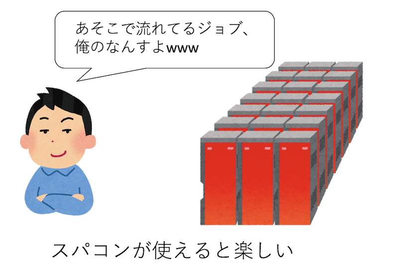

# 一週間でなれる！スパコンプログラマ

[](https://creativecommons.org/licenses/by/4.0/)

## はじめに

世の中にはスーパーコンピューター、略してスパコンというものがある。こういうすごそうな名前があるものの例にもれず、「スパコンとはなにか」という定義は曖昧である。人によって「何がスパコンか」の定義は違うと思うが、とりあえずここではCPUとメモリを積んだ「ノード」がたくさんあり、それらが高速なネットワークでつながっていて、大きなファイルシステムを持っているもの、と思っておけば良いと思う。

スパコンは名前に「スーパー」とついているだけに、「なんかすごそうなもの」「使うのが難しいもの」という印象を持つ人もいるだろう。しかし、スパコンを使うのに要求される技術そのものは非常に単純かつ簡単である。自分の経験として、プログラミングの素養がある学生であれば、詳しい人に一ヶ月もレクチャーを受ければ普通にスパコンにジョブを投げ始める。そのくらいスパコンを使うのは簡単なことである。しかし、スパコンは、「使いはじめる」のは簡単であるものの、「使い倒す」のはかなり難しい。経験的に、並列数が十進法で一桁増えるごとに、本質的に異なる難しさに直面する。例えば百並列で走ったコードが千並列で走らなかったり、千並列で走ったコードが一万並列でコケたりする。そのあたりの奥の深さは面白いものの、本稿では扱わない。

この記事では、近くにスパコンに詳しい人がいない人のために、「とりあえず7日間でスパコンを使えるようになる」ことを目指す。

勢いで一応リポジトリを作ったが、書き上がるかどうかはノストラダムスにもわかりません。

## Day 0 : なぜスパコンを使うのか

そもそも、なぜスパコンを使うのか？それは、そこにスパコンがあるからだ。
この日本語で書かれた文章を読んでいるということは、あなたは高確率で日本人であろう。おめでとう。あなたは世界有数のスパコンを使うことができる。なぜなら日本はスパコン大国だからだ。Top500のサイトに行くと、世界の性能トップ500に入るスパコンの、国の内訳を見ることができる。2018年6月時点で、トップは中国の206サイト、二位がアメリカの124サイト、日本は36サイトで三位に入っている。最近の中国の躍進は目覚ましいのだが、そこはさておく。Top500に入るスパコン数は世界三位で、しかも何度も世界一位となるスパコンを保持している日本は、世界有数のスパコン大国と言ってよいだろう。

個人的な経験で、こんなことがあった。とある海外の方と共同研究をしていた時、共同研究者に「こんな計算をしてみたらどうだろう」と提案してみた。
すると彼に「そういうことができたら面白いとは思うけど、計算が重すぎて無理だよ」と言われたので「いや、うちのスパコンでやったら一日仕事だ」と言ったらえらく驚いていた。これは、単に「日本は計算資源に恵まれている」という話にとどまらず、**人の想像力の上限は、普段使っている計算資源の規模で決まる**ということを示唆する。これは極めて重要だと思う。

普通、スパコンを使うのは、「まずローカルなPCで計算をして、それで計算が苦しくなってから、次のステップアップとしてスパコンを検討する」といった順番となるだろう。その時も、まず「これくらいの規模のスパコンを使ったら、これくらいの計算ができる」という事前の検討をしてからスパコンの利用申請をするであろう。つまり「テーマ(目的)が先、スパコン(手段)が後」となる。それは全くもって正しいのであるが、私個人の意見としては、「やることが決まってなくても、どのくらいの計算が必要かわからなくても、まずスパコンを使ってしまう」方がいろいろ良いと思う。普段からローカルPCでしか計算していない人は、なにか研究テーマを検討する際に、スパコンが必要となるテーマを無意識に却下してしまう。逆に、普段からスパコンを使いなれていると、想像力の上限が引き上げられ、普通のPCでは計算できないような選択肢を検討できる。つまり「スパコン(手段)が先、テーマ(目的)は後」である。そもそもスパコンを使うのはさほど難しくないのだし、いろいろ検討する前に、ささっと使い始めてみよう。

### 注意

並列プログラミングに限らないことだが、なにかを始めようとすると、ちょっと先にそれを始めていた人がなんやかんや言ってくることだろう。「並列化効率ガー」「そもそも実行効率が悪いコードを並列化するなんて云々」とか「最初から通信の最適化を考慮云々」とか、そういうことを言ってくる人が必ず湧くが、とりあえず二年くらいは無視してかまわない。なにはともあれスパコンを使えるようになること、チューニング不足の遅いコードであろうが並列化効率が悪かろうが、とりあえずそれなりのノード数で走るコードを書いて実行してみること、まずはそこを目指そう。それなりのノード数で走るコードが書ける、それだけで十分強力な武器になる。



## Day 1 : 環境構築

スパコン上で実行されるプログラムは並列プログラムである。したがって「スパコンを使う」ということは、
狭義には「並列化されたプログラムを実行する」ということを意味する。したがって、誰かが作った並列プログラムをスパコン上で実行すれば、スパコンは使えることになる。
それはそれでOKなのだが、本稿のタイトルは「一週間でなれる！スパコンプログラマ」であるから、スパコン上で動くコードを開発できるようになることを目的とする。
それはすなわち、「並列プログラミングをする」ということである。「並列プログラミング」という字面を見ると「難しそう」という印象を持つかもしれない。
しかし、(世の中の多くの「一見難しそうなもの」がそうであるように)並列プログラミングはさほど難しくない。
「一週間でなれる！スパコンプログラマ」の初日は、まずローカルに並列プログラミング環境を構築し、並列プログラミングに触れてみるところからはじめてみよう。

### MPIとは

一口に「並列化」といっても、様々な種類がありえる。一般に使われている並列プログラミングモデルは、「データ並列」「共有メモリ並列」「分散メモリ並列」の三種類であろう。
以後、プロセスやスレッドといった単語についてかなりいい加減な言葉遣いをするため、ちゃんと学びたい人はちゃんとした書籍を参考にされたい。特にWindowsとLinuxのプロセスの違いとか言い出すと話が長くなるので、ここでは説明しない。また、データ並列についてはとりあえずおいておく。

「共有メモリ並列」とは、並列単位がメモリを共有する並列化方法である。
通常は並列単位としてスレッドを用いるので、ここでは「スレッド並列」と呼ぶ。
逆に「分散メモリ並列」とは、並列単位がメモリを共有しない並列化方法である。
通常は並列単位としてプロセスを用いるので、ここでは「プロセス並列」と呼ぶ。
また、「プロセス並列」と「スレッド並列」を両方行う「ハイブリッド並列」という並列化もある。

まずはプロセスとスレッドの違いについて見てみよう。プロセスとは、OSから見た資源の管理単位である。
プロセスはOSから様々な権限を与えられるが、最も重要なことは「OSから独自のメモリ空間を割り当てられる」ことである。異なるプロセスは異なるメモリ空間を持っており、適切な権限がなければ他のプロセスのメモリを参照できない(そうしないとセキュリティ的に問題がある)。

スレッドとはCPUの利用単位である。通常、一つのCPUコアを利用できるのは一度に一つのスレッドだけである(SMTなどはさておく)。各プロセスは最低一つのスレッドを持っており、プログラムの実行とは、スレッドがCPUコアを使いにいくとである。図解するとこんな感じになる。


「スレッド並列」では、一つのプロセスの中に複数のスレッドを立ち上げ、各スレッドが複数のCPUコアを使うことで性能向上をはかる。複数のスレッドが一つのメモリを共有するため、「共有メモリ並列」となる。例えばOpenMPでディレクティブを入れたり、`std::thread`などを使って明示的にスレッドを起動、制御することで並列化を行う。同じプロセス内のスレッドはメモリを共有するため、お互いに通信をする必要はないが、同時に同じところを書き換えたりしないようにプログラマの責任で排他制御を行う必要がある。コンパイラによっては自動並列化機能を持っているが、それで実現されるのはこのスレッド並列である。

「プロセス並列」とは、複数のプロセスを立ち上げ、それぞれのプロセスに属すスレッドがCPUコアを使いにいくことで性能向上をはかる。プロセス並列はMPI(Message Passing Interface)というライブラリを使って行う。それぞれのプロセスは独自のメモリ空間を持っており、基本的にはお互いから見えないため、意味のある並列化を行うためには、必要に応じて通信を行わなければならない。

さて、プロセス並列とスレッド並列では、一般的にはスレッド並列の方がとっつきやすいと言われている。
以下のような単純なループがあったとする。

```cpp
const int SIZE = 10000;
void func(double a[SIZE], double b[SIZE])
for (int i=0; i < SIZE; i++) {
  a[i] += b[i];
}
```

これをOpenMPでスレッド並列化したければ、以下のようなディレクティブを入れるだけで良い。

```cpp
const int SIZE = 10000;
#pragma omp parallel for  // ← OpenMPによる並列化の指示
void func(double a[SIZE], double b[SIZE])
for (int i=0; i < SIZE; i++) {
  a[i] += b[i];
}
```

同じようなことをMPIでやろうとするとわりとごちゃごちゃ書かなければいけない上に、下手な書き方をするとオーバーヘッドが大きくなって効率が悪くなるかもしれない。しかし、スレッド並列はプロセスの中の並列化であり、一つのプロセスは複数のOSにまたがって存在できないため、複数のノード(ノードの説明については後述)を同時に使うことができない。

逆にプロセス並列の場合は、各プロセスが独立したメモリを保持しているため、他のプロセスの保持するデータがほしければ通信を行う必要がある。この通信はユーザが関数呼び出しを使って明示的に行わなければならない。ただし、通信は別のハードにある別のOS上で実行中の別のプロセスとも行うことができるため、複数のノードを同時に使うことができる。


上図に、簡単に「スレッド並列」と「プロセス並列」の違いをまとめた。本稿の目的は「スパコンプログラマ」になることであり、「スパコン」とは複数のノードを束ねたものであり、「スパコンプログラミング」とは複数のノードをまとめて使うことであるから、論理的必然としてスパコンプログラミングをするためにはプロセス並列が必要となる。というわけで、本稿では主にMPIを用いた分散メモリ並列を取り上げる。

### 余談：MPIは難しいか

たまに「スレッド並列は簡単」「MPIは難しい」という声を聞く。しかし、それなりの期間スパコンと関わって思うのは、「どちらかいえばスレッド並列の方が難しい」「MPIは面倒くさいが難しくない」というのが実感である。

確かにOpenMPなんかを使えば、一行いれるだけでスレッド並列化されて、簡単に数倍の性能が得られたりする。しかし、性能が出なかった時に「なぜ性能が出なかったのか」を調べるのはとても大変である。なぜならOpenMPを使うと「どのように並列化されたか」が隠蔽されてしまうからだ。基本的にはコンパイラが吐くレポートを見て、どのように並列化されたかを「想像」しながら調査をする必要がある。また、同じメモリを複数のスレッドが同時に触りにくるため、「タイミングによってはバグる」という問題を起こす。**この手のマルチスレッドプログラミングのデバッグは一般に地獄である**。少なくとも私はやりたくない。

MPIはいろいろ書かなければならないことが多く、確かに面倒である。しかし、基本的には「書いた通り」に並列化される(ここ読んだプロが「そんなことない！」と怒っている顔が目に浮かぶが、まぁOpenMPと比較して、の話ですよ)。
また、各プロセスのメモリは各プロセスだけのものである。通信するにしても、自分が用意したバッファに他のプロセスが書き込んでくるため、「いつ」「どこに」「誰が」「どのくらい」書き込んでくるかがわかる。これはデバッグするのに非常に重要な情報である。

そんなわけで、「どうせ並列化するなら、最初からMPIで書いてしまえばいいんじゃない？複数ノードを使えるようにもなるし」というのが私の見解である。MPIで必要となる関数も、初期化(`MPI_Init`)と後処理(`MPI_Finalize`)を除けば、相互通信(`MPI_Sendrecv`)と集団通信(`MPI_Allreduce`)の二つだけ知っていればたいがいのことはなんとかなる。それ以上にややこしいことをやりたくなったら、その時にまた調べれば良い。

### MPIのインストール

スパコンを使う前に、まずはローカルPCでMPIによる並列プログラミングに慣れておこう。MPIの開発環境としては、Mac OSX、もしくはLinuxを強く推奨する(というか筆者はWindowsでの並列プログラミング環境の構築方法を知らない)。Linuxはなんでも良いが、とりあえずCentOSを想定する。本稿の読者なら、GCCくらいは既に利用可能な状況であろう。あとはMPIをインストールすれば並列プログラミング環境が整う。

MacでHomebrewを使っているなら、

```sh
brew install openmpi
```

で一発、CentOSなら、

```sh
sudo yum install openmpi-devel 
export PATH=$PATH:/usr/lib64/openmpi/bin/ 
```

でおしまいである。ここで

```sh
sudo yum install openmpi
```

とすると、開発環境がインストールされないので注意。

インストールがうまくいったかどうかは、MPI用コンパイラ`mpic++`にパスが通っているかどうかで確認できる。
実は、mpic++はインクルードパスやリンクの設定をユーザの代わりにやってくれるラッパーに過ぎず、実際のコンパイラは`clang++`、もしくは`g++`が使われる。

例えばMacでは

```sh
$ mpic++ --version 
Apple LLVM version 10.0.0 (clang-1000.11.45.2)
Target: x86_64-apple-darwin17.7.0
Thread model: posix
InstalledDir: /Applications/Xcode.app/Contents/Developer/Toolchains/XcodeDefault.xctoolchain/usr/bin
```

と、clang++にパスが通っていることがわかる。Linuxの場合はg++である。

```sh
$ mpic++ --version
g++ (GCC) 4.8.5 20150623 (Red Hat 4.8.5-28)
Copyright (C) 2015 Free Software Foundation, Inc.
This is free software; see the source for copying conditions.  There is NO
warranty; not even for MERCHANTABILITY or FITNESS FOR A PARTICULAR PURPOSE.
```

したがって、インクルードパスやリンクの設定を明示的にするならば、`mpic++`を呼び出す必要はない。
スパコンサイトによっては、環境変数でMPIのインクルードパスが設定されている場合もあるだろう。その場合は単に`g++`でも`icpc`でも、MPIを用いたコードがそのままコンパイルできる。ただし、リンクのために`-lmpi`の指定が(場合によっては`-lmpi_cxx`も)必要なので注意。

### はじめてのMPI

環境構築ができたら、こんなコードを書いて、[hello.cpp](day1/hello.cpp)という名前で保存してみよう。

```c++
#include <cstdio>
#include <mpi.h>

int main(int argc, char **argv) {
  MPI_Init(&argc, &argv);
  printf("Hello MPI World!\n");
  MPI_Finalize();
}
```

以下のようにしてコンパイル、実行してみる。

```
$ mpic++ hello.cpp
$ ./a.out
Hello MPI World!
```

せっかくなので並列実行する前に、`mpic++`を使わずにコンパイルできることを確認してみよう。Macの場合、`g++`で先程の`hello.cpp`をコンパイルしようとすると「mpi.hが見つからないよ」と怒られる。

```sh
$ g++ hello.cpp
hello.cpp:2:10: fatal error: mpi.h: No such file or directory
 #include <mpi.h>
          ^~~~~~~
compilation terminated.
```

なので、コンパイラにその場所を教えてあげればよい。ヘッダファイルの場所だけ教えても「ライブラリが見つからないよ」と怒られるので、それも一緒に教えてあげよう。

```sh
g++ hello.cpp -I/usr/local/opt/open-mpi/include -L/usr/local/opt/open-mpi/lib -lmpi  -lmpi_cxx
```

問題なくコンパイルできた。ちなみに筆者の手元のCentOSでは、

```sh
g++ test.cpp -I/usr/include/openmpi-x86_64 -L/usr/lib64/openmpi/lib -lmpi -lmpi_cxx
```

でコンパイルできた。環境によってパスは異なるが、インクルードパスとライブラリパス、そしてライブラリ`-lmpi`(環境によっては`-lmpi_cxx`も)を指定すれば`mpic++`を使わなくてもコンパイルできる。「`mpic++`はラッパに過ぎず、ヘッダとライブラリを正しく指定すればどんなコンパイラでも使える」と知っていると、MPI関連でトラブルが起きた時にたまに役に立つので覚えておきたい。

さて、並列実行してみよう。並列実行には`mpirun`の引数に実行プログラムと並列数を指定する。

```sh
$ mpirun -np 2 ./a.out
Hello MPI World!
Hello MPI World!
```

メッセージが二行表示された。プログラムの実行の際、こんなことが起きている。

1. `mpirun`が`-np 2`を見て、プロセスを2つ立ち上げる。
2. `MPI_Init`が通信環境を初期化する
3. 各プロセスが、それぞれ`Hello MPI World`を実行する。
4. `MPI_Finalize`が通信環境を終了する。

複数のプロセスが立ち上がり、なにか処理をしているのだから、これは立派な並列プログラムである。しかし、このままでは、全てのプロセスが同じ処理しかできない。そこで、MPIは立ち上げたプロセスに **ランク(rank)** という通し番号を振り、それを使って並列処理をする。

### ランク

MPIでは、起動したプロセスに通し番号が振られる。その通し番号のことを **ランク(rank)** と呼ぶ。
ランクの取得には`MPI_Comm_rank`関数を使う。

```cpp
int rank;
MPI_Comm_rank(MPI_COMM_WORLD, &rank);
```

これを実行すると変数`rank`にランク番号が入る。N並列している場合、ランクは0からN-1までである。
試してみよう。

[day1/rank.cpp](day1/rank.cpp)

```cpp
#include <cstdio>
#include <mpi.h>

int main(int argc, char **argv) {
  MPI_Init(&argc, &argv);
  int rank;
  MPI_Comm_rank(MPI_COMM_WORLD, &rank);
  printf("Hello! My rank is %d\n", rank);
  MPI_Finalize();
}
```

実行するとこうなる。

```sh
$ mpic++ rank.cpp  
$ mpirun -np 4 ./a.out
--------------------------------------------------------------------------
There are not enough slots available in the system to satisfy the 4 slots
that were requested by the application:
  ./a.out

Either request fewer slots for your application, or make more slots available
for use.
--------------------------------------------------------------------------
```

おっと、エラーが出た。このエラーは「予め定義されたスロット数よりプロセス数が多いよ」というもので、
筆者の環境ではMacでは出るが、Linuxではでない。このエラーが出た場合は`mpirun`に
`--oversubscribe`オプションをつける。

```sh
$ mpirun --oversubscribe -np 4 ./a.out
Hello! My rank is 0
Hello! My rank is 2
Hello! My rank is 1
Hello! My rank is 3
```

無事にそれぞれのプロセスで異なるランク番号が表示された。

MPIプログラムでは、全く同じソースコードのレプリカが作成される。違いはこのランクだけである。
したがって、プログラマはこのランク番号によって処理を変えることで、並列処理を書く。
どんな書き方をしても自由である。例えば4並列実行する場合、

```cpp
#include <cstdio>
#include <mpi.h>

int main(int argc, char **argv) {
  MPI_Init(&argc, &argv);
  int rank;
  MPI_Comm_rank(MPI_COMM_WORLD, &rank);
  if (rank == 0) {
    // Rank 0の処理
  } else if (rank == 1) {
    // Rank 1の処理
  } else if (rank == 2) {
    // Rank 2の処理
  } else if (rank == 3) {
    // Rank 3の処理
  }
  MPI_Finalize();
}
```

みたいな書き方をしても良い。この場合、ランク0から3まで全く関係のない仕事をさせることができる。
まぁ、普通はこういう書き方をせずに、後で説明する「サンプル並列」「パラメタ並列」や、「領域分割」をすることが多いが、
「そうすることが多い」というだけで、「そうしなければならない」ということではない。
まとめると、

* MPIは、複数のプロセスを起動する
* それぞれのプロセスには、「ランク」という一意な通し番号が振られる。
* MPIプログラムは、ランクの値によって処理を変えることで、プロセスごとに異なる処理をする

こんな感じになる。これがMPIプログラムのすべてである。なお、複数のノードにまたがってMPIプロセスを
立ち上げた場合でも、ランク番号は一意に振られる。例えば、ノードあたり4プロセス、10ノードで実行した場合、
全体で40プロセスが起動されるが、それぞれに0から39までのランク番号が振られる。
その番号が、各ノードにどのように割当られるかは設定に依るので注意。

### 標準出力について

さて、端末で

```sh
mpirun -np 4 ./a.out
```

などとしてMPIプログラムを実行したとする。この場合は4プロセス立ち上がり、それぞれにPIDが与えられ、
固有のメモリ空間を持つ。しかし、これらのプロセスは標準出力は共有している。
したがって、「せーの」で標準出力に出力しようとしたら競合することになる。
この時、例えば他のプロセスが出力している時に他のプロセスが書き込んだり、出力が混ざったりしないように、
後ろで交通整理が行われる。そもそも画面になにかを表示する、というのはわりと奥が深いのだが、
そのあたりの話は[tanakamura](https://github.com/tanakamura)さんの
[実践的低レベルプログラミング ](https://tanakamura.github.io/pllp/docs/)とかを読んでほしい。

さて、とにかく今は標準出力というリソースは一つしかないのに、4つのプロセスがそこを使う。
この時、「あるひとかたまりの処理については、一つのプロセスが独占して使う」ようにすることで
競合が起きないようにする。
「ひとかたまりの処理」とは、例えば「`printf`で出力を始めてから終わるまで」である。

例えば先程の[day1/rank.cpp](day1/rank.cpp)の例では、

```cpp
printf("Hello! My rank is %d\n", rank);
```

という命令があった。ここでは、まず出力すべき文字列、例えば
`Hello! My rank is 0`を作る。そして、せーので書き出す。
イメージとしては

```cpp
puts("Hello! My rank is 0");
puts("Hello! My rank is 1");
puts("Hello! My rank is 2");
puts("Hello! My rank is 3");
```

という4つの命令が「ランダムな順番で」に実行される。
しかし、順番が入れ替わっても

```cpp
puts("Hello! My rank is 0");
puts("Hello! My rank is 2");
puts("Hello! My rank is 1");
puts("Hello! My rank is 3");
```

とかになるだけで、さほど表示は乱れない。

さて、同様なプログラムを`std::cout`で書いてみよう。

こんな感じになると思う。

[day1/rank_stream.cpp](day1/rank_stream.cpp)

```cpp
#include <iostream>
#include <mpi.h>

int main(int argc, char **argv) {
  MPI_Init(&argc, &argv);
  int rank;
  MPI_Comm_rank(MPI_COMM_WORLD, &rank);
  std::cout << "Hello! My rank is " << rank << std::endl;
  MPI_Finalize();
}
```

さて、この場合は、プロセスの切り替わりタイミング(標準出力の占有期限)が`<<`で切り替わる可能性がある。

イメージとしては、

```cpp
std::cout << "Hello! My rank is ";
std::cout << "0";
std::cout << std::endl;
std::cout << "Hello! My rank is ";
std::cout << "1";
std::cout << std::endl;
std::cout << "Hello! My rank is ";
std::cout << "2";
std::cout << std::endl;
std::cout << "Hello! My rank is ";
std::cout << "3";
std::cout << std::endl;
```

という命令が「ランダムな順番で」に実行される可能性がある。

すると、例えば

```
Hello! My rank isHello! My rank is
0
1
Hello! My rank is 3

Hello! My rank is 2
```

のように表示が乱れる可能性がある。

なぜ「可能性がある」と書いているかというと、いま試してみたら再現せず、普通に

```sh
$ mpirun -np 4 ./a.out
Hello! My rank is 0
Hello! My rank is 2
Hello! My rank is 3
Hello! My rank is 1
```

と乱れずに表示されるからだ。昔はもっと乱れた気がしたのだが・・・

いずれにせよ、高並列で試してみたらたまには表示が乱れるので、もし標準出力を使いたいなら、一度`std::stringstream`にまとめてから一度に書き出すか、素直に`printf`を使うほうが良いと思う。

なお、MPIのデバッグ目的に標準出力を使うのは良いが、例えば結果の出力や計算の進捗の出力に使うのはあまりおすすめできない。そのあたりはジョブスケジューラを用いたジョブの実行のあたりで説明すると思う。

ちなみに、Open MPIには「各ランクごとの標準出力を、別々のファイルに吐き出す」というオプションがある。

参考：[MPIプログラムのデバッグ](https://qiita.com/nariba/items/2277c2eb428886eae80d)

例えば、先程の例では、

```sh
$ mpirun --output-filename hoge -np 4 ./a.out
```

とすると、Linuxでは標準出力の代わりに`hoge.1.X`というファイルがプロセスの数だけ作成され、そこに保存される。中身はこんな感じ。

```sh
$ ls hoge.*  
hoge.1.0  hoge.1.1  hoge.1.2  hoge.1.3

$ cat hoge.1.0
Hello! My rank is 0

$ cat hoge.1.1
Hello! My rank is 1
```

Macで同様なことをすると、以下のようにディレクトリが掘られる。

```sh
$ mpiexec --output-filename hoge -np 4 --oversubscribe ./a.out
Hello! My rank is 0
Hello! My rank is 1
Hello! My rank is 2
Hello! My rank is 3

$ tree hoge
hoge
└── 1
    ├── rank.0
    │   ├── stderr
    │   └── stdout
    ├── rank.1
    │   ├── stderr
    │   └── stdout
    ├── rank.2
    │   ├── stderr
    │   └── stdout
    └── rank.3
        ├── stderr
        └── stdout
```

標準出力にも出力した上で、各ディレクトリに、各プロセスの標準出力と標準エラー出力が保存される。覚えておくと便利な時があるかもしれない。

### GDBによるMPIプログラムのデバッグ

本稿の読者の中には普段からgdbを使ってプログラムのデバッグを行っている人がいるだろう。
並列プログラムのデバッグは一般に極めて面倒だが、とりあえずgdbを使ったMPIプログラムのデバッグ方法を知っていると将来何かの役に立つかもしれない。
あと、これは筆者だけかもしれないが、ソース読んだりするより、gdb経由でプログラムの振る舞いを解析したほうがなんかいろいろ理解しやすかったりする。
というわけで、gdbでMPIプロセスにアタッチする方法を紹介する。普段からgdbを使っていなければこの節は読み飛ばしてかまわない。

gdbでデバッグできるのは一度に一つのプロセスのみである。しかし、MPIプログラムは複数のプロセスを起動する。
したがって、

* 起動されたすべてのプロセスについてgdbをアタッチする
* 特定のプロセス一つだけにgdbをアタッチする

の二通りの方法が考えられる。ここでは後者の方法を採用する。なお、両方の方法が[Open MPIのFAQ: Debugging applications in parallel](https://www.open-mpi.org/faq/?category=debugging)に記載されているので興味のある方は参照されたい。

gdbは、プロセスIDを使って起動中のプロセスにアタッチする機能がある。そこで、まずMPIプログラムを実行し、その後で
gdbで特定のプロセスにアタッチする。しかし、gdbでアタッチするまで、MPIプログラムには特定の場所で待っていてほしい。
というわけで、

* 故意に無限ループに陥るコードを書いておく
* MPIプログラムを実行する
* gdbで特定のプロセスにアタッチする
* gdbで変数をいじって無限ループを脱出させる
* あとは好きなようにデバッグする

という方針でいく。なお、なぜかMac OSではMPIプロセスへのgdbのアタッチがうまくいかなかったので、以下はCentOSで実行している。

こんなコードを書く。

[gdb_mpi.cpp](day1/gdb_mpi.cpp)

```cpp
#include <cstdio>
#include <sys/types.h>
#include <unistd.h>
#include <mpi.h>

int main(int argc, char **argv) {
  MPI_Init(&argc, &argv);
  int rank;
  MPI_Comm_rank(MPI_COMM_WORLD, &rank);
  printf("Rank %d: PID %d\n", rank, getpid());
  fflush(stdout);
  int i = 0;
  int sum = 0;
  while (i == rank) {
    sleep(1);
  }
  MPI_Allreduce(&rank, &sum, 1, MPI_INT, MPI_SUM, MPI_COMM_WORLD);
  printf("%d\n", sum);
  MPI_Finalize();
}
```

`MPI_Allreduce`はまだ説明していないが、全プロセスで変数の総和を取る関数である。
このコードは、自分のPIDを出力してから、ランク0番のプロセスだけ無限ループに陥る。
このコードを`-g`つきでコンパイルし、とりあえず4プロセスで実行してみよう。

```sh
$ mpic++ -g gdb_mpi.cpp
$ mpirun -np 4 ./a.out
Rank 2: PID 3646
Rank 0: PID 3644
Rank 1: PID 3645
Rank 3: PID 3647
```

4プロセス起動して、そこでランク0番だけ無限ループしているので、他のプロセスが待ちの状態になる。
この状態でランク0番にアタッチしよう。もう一枚端末を開いてgdbを起動、ランク0のPID(実行の度に異なるが、今回は3644)にアタッチする。

```sh
$ gdb
(gdb) attach 3644
Attaching to process 3644
Reading symbols from /path/to/a.out...done.
(snip)
(gdb)
```

この状態で、バックトレースを表示してみる。

```sh
(gdb) bt
#0  0x00007fc229e2156d in nanosleep () from /lib64/libc.so.6
#1  0x00007fc229e21404 in sleep () from /lib64/libc.so.6
#2  0x0000000000400a04 in main (argc=1, argv=0x7ffe6cfd0d88) at gdb_mpi.cpp:15
```

sleep状態にあるので、`main`関数から`sleep`が、`sleep`から`nanosleep`が呼ばれていることがわかる。
ここから`main`に戻ろう。`finish`を二回入力する。

```sh
(gdb) finish
Run till exit from #0  0x00007fc229e2156d in nanosleep () from /lib64/libc.so.6
0x00007fc229e21404 in sleep () from /lib64/libc.so.6
(gdb) finish
Run till exit from #0  0x00007fc229e21404 in sleep () from /lib64/libc.so.6
main (argc=1, argv=0x7ffe6cfd0d88) at gdb_mpi.cpp:14
14	  while (i == rank) {
```

`main`関数まで戻ってきた。この後、各ランク番号`rank`の総和を、変数`sum`に入力するので、
`sum`にウォッチポイントを設定しよう。

```sh
(gdb) watch sum
Hardware watchpoint 1: sum
```

現在は変数`i`の値が`0`で、このままでは無限ループするので、変数の値を書き換えてから続行(continue)してやる。

```sh
(gdb) set var i = 1
(gdb) c
Continuing.
Hardware watchpoint 1: sum

Old value = 0
New value = 1
0x00007fc229eaa676 in __memcpy_ssse3 () from /lib64/libc.so.6
```

ウォッチポイントにひっかかった。この状態でバックトレースを表示してみよう。

```sh
(gdb) bt
#0  0x00007fc229eaa676 in __memcpy_ssse3 () from /lib64/libc.so.6
#1  0x00007fc229820185 in opal_convertor_unpack ()
   from /opt/openmpi-2.1.1_gcc-4.8.5/lib/libopen-pal.so.20
#2  0x00007fc21e9afbdf in mca_pml_ob1_recv_frag_callback_match ()
   from /opt/openmpi-2.1.1_gcc-4.8.5/lib/openmpi/mca_pml_ob1.so
#3  0x00007fc21edca942 in mca_btl_vader_poll_handle_frag ()
   from /opt/openmpi-2.1.1_gcc-4.8.5/lib/openmpi/mca_btl_vader.so
#4  0x00007fc21edcaba7 in mca_btl_vader_component_progress ()
   from /opt/openmpi-2.1.1_gcc-4.8.5/lib/openmpi/mca_btl_vader.so
#5  0x00007fc229810b6c in opal_progress ()
   from /opt/openmpi-2.1.1_gcc-4.8.5/lib/libopen-pal.so.20
#6  0x00007fc22ac244b5 in ompi_request_default_wait_all ()
   from /opt/openmpi-2.1.1_gcc-4.8.5/lib/libmpi.so.20
#7  0x00007fc22ac68955 in ompi_coll_base_allreduce_intra_recursivedoubling ()
   from /opt/openmpi-2.1.1_gcc-4.8.5/lib/libmpi.so.20
#8  0x00007fc22ac34633 in PMPI_Allreduce ()
   from /opt/openmpi-2.1.1_gcc-4.8.5/lib/libmpi.so.20
#9  0x0000000000400a2c in main (argc=1, argv=0x7ffe6cfd0d88) at gdb_mpi.cpp:17
```

ごちゃごちゃっと関数呼び出しが連なってくる。MPIは規格であり、様々な実装があるが、今表示されているのはOpen MPIの実装である。内部で`ompi_coll_base_allreduce_intra_recursivedoubling`とか、それっぽい関数が呼ばれていることがわかるであろう。興味のある人は、[OpenMPIのソース](https://www.open-mpi.org/source/)をダウンロードして、上記と突き合わせてみると楽しいかもしれない。

さて、続行してみよう。二回continueするとプログラムが終了する。

```sh
(gdb) c
Continuing.
Hardware watchpoint 1: sum

Old value = 1
New value = 6
0x00007fc229eaa676 in __memcpy_ssse3 () from /lib64/libc.so.6
(gdb) c
Continuing.
[Thread 0x7fc227481700 (LWP 3648) exited]
[Thread 0x7fc226c80700 (LWP 3649) exited]

Watchpoint 1 deleted because the program has left the block in
which its expression is valid.
0x00007fc229d7e445 in __libc_start_main () from /lib64/libc.so.6
```

`mpirun`を実行していた端末も、以下のような表示をして終了するはずである。

```sh
$ mpic++ -g gdb_mpi.cpp
$ mpirun -np 4 ./a.out
Rank 2: PID 3646
Rank 0: PID 3644
Rank 1: PID 3645
Rank 3: PID 3647
6
6
6
6
```

ここではgdbでMPIプロセスにアタッチするやり方だけを説明した。ここを読むような人はgdbを使いこなしているであろうから、アタッチの仕方さえわかれば、後は好きなようにデバッグできるであろう。
ただし、私の経験では、並列プログラミングにおいてgdbを使ったデバッグは最終手段であり、できるだけ細かくきちんとテストを書いて、そもそもバグが入らないようにしていくことが望ましい。

## Day 2 : ジョブの投げ方

### スパコンとは

スパコンを使うのに、必ずしもスパコンがどのように構成されているかを知る必要はない。しかし、せっかくスパコンを使うのだから、スパコンとは何かについて簡単に知っておいても良いであろう。
ただし、こういう単語にありがちだが「何がスパコンか」は人によって大きく異なる。ここで紹介するのはあくまで「執筆者が思うスパコンの定義」の説明であり、他の人は他の定義があることを承知されたい。

普通のPCは、CPU、メモリ、ネットワーク、ディスクなどから構成されている。スパコンも全く同様に、CPU、メモリ、ネットワーク、ディスクがある。
それぞれちょっと高級品を使っているだけで、基本的には普通のPCと同じと思って良い。ただし、PCとはつなぎ方がちょっと異なる。
スパコンは、CPUとメモリをまとめたものを「ノード」と呼ぶ。このノードをたくさん集めて高速なネットワークでつないだものがスパコン本体である。普通のPCではCPUの近くにメモリがあったが、最近のスパコンのノードはディスクレスの構成にすることが多い。そのかわり、大きなファイルシステムとネットワークでつなぐ。


一般的なスパコンの構成は上図のような感じになる。ノードは大きく分けて「ログインノード」と「計算ノード」の二種類がある。ユーザはインターネット経由でログインノードにログインし、そこで作業をする。実際の計算は計算ノードで行う。ログインノード、計算ノード、ファイルシステムは、高速なネットワークで接続されている。この高速ネットワークは長らくInfiniBandという規格がデファクトスタンダードとなっていたが、近年になってIntelのOmniPathの採用例も増えているようである。ファイルシステムについては、Lustreというファイルシステムがデファクトスタンダードであるが、目的によってはGPFS(今はIBM Spectrum Scaleに名前が変わったらしい)なども選択される。

さて、「ノード」という呼び方をしているが、これは本質的にはパソコンと同じものなので、スパコンとはパソコンを大量に並べて高速なネットワークで相互につないだもの、と言える。特に最近はCPUとしてx86の採用が多いため、ますます「普通のスパコンを大量に並べたもの」という印象が強くなるだろう。しかし、**「普通のパソコンを大量に並べたらスパコンになるか」というとそうではない**。スパコンで最も重要なもの、それは「信頼性」である。

普通にPCを使っていたら、わりとPCの部品は壊れることを知っているであろう。ありとあらゆる箇所が壊れる可能性があるが、ファンやディスクなどの回るものなどは特に壊れやすい。また、メモリなどもよく壊れるものの代表である。CPUやマザー、ネットワークカードなども壊れる。スパコンは多くの部品から構成されるため、壊れるのが非常に稀であっても、全体としては無視できない確率で壊れてしまう。

例えば「京コンピュータ」が10ペタフロップスを達成した時には、[計算の実行に88128ノードを使って29時間28分かかっている](http://www.riken.jp/pr/topics/2011/20111102/)。これは約260万ノード時間であるから、この計算が90%の確率で実行できるためには、各ノードが3000年くらいは壊れない「保証」が必要になる。
逆に、もし各ノードが1年に一度くらい壊れるならば、およそ6分に一度どこかのノードが壊れることになり、とても使い物にならない。


つまり、大規模計算とは大縄跳びのようなものであり、それなりのノード数でまともに計算を行うためには、かなり高信頼なシステムを組む必要があることがわかるであろう。他にも様々な「スパコンらしさ」「スパコンならではの工夫」はあるのだが、なにはともあれ「高信頼であること」が非常に重要である。たまにゲーム機や格安チップを並べて「格安スパコン」を作った、というニュースが話題になるのだが、実はスパコンでは計算部分だけでなく「信頼性」と「ネットワーク」にかなりコストがかかっており、そこをケチると、当然ながら「信頼性」や「ネットワーク」が必要とされる計算ができないスパコンになる。もちろん「やりたい計算」が「格安スパコン」でできるのであればそれを選択すれば良いが、ただピーク性能と値段を比較して「スパコンは高い」と即断しないようにしてほしい。星の王子さまも「いちばんたいせつなことは、目に見えない」って言ってることだしね・・・。

TODO: BlueGeneのメモリエラー訂正について書く？

### スパコンのアカウントの取得方法

スパコンを使うためには、スパコンのアカウントを手に入れなければならない。ある意味ここが最難関である。スパコンを使う技術そのものは非常に簡単に身につくが、スパコンのアカウントを手に入れる、というのは技術に属すスキルではないからだ。

とりあえず、世の中には様々なスパコンがある。企業が開発のためにスパコンを導入していることもあるし、最近はクラウドもスパコンと呼んで良いような計算資源を用意している。将棋ソフト、Ponanzaの開発者の山本さんは機械学習のための計算資源が足りず、[さくらインターネットにお願いして大規模な計算資源を借りた](http://ascii.jp/elem/000/001/171/1171630/index-2.html)そうなのだが、そういう強いメンタルを持っていない人は、通常の手続きでスパコンのアカウントを取得しよう。

まず、スパコンといえば、大型計算機センター(大計センター)である。たとえば[東京大学情報基盤センター](https://www.itc.u-tokyo.ac.jp/)のようなところは、申請すれば、かなり割安な金額で計算資源を借りることができる。また、様々な公募を行っており、共同研究という形で無料で計算資源を借りることもできるようである。

[物性研究所](http://www.issp.u-tokyo.ac.jp/supercom/)は、テーマが「物性科学」に限られるが、申請が認められれば無料で計算資源を利用できる。ただし、利用資格は修士以上(原則として学部生不可)、申請資格は給料をもらっている研究者(ポスドク以上)なので注意。

「二位じゃだめなんでしょうか？」で話題となった[「京コンピュータ」もテーマを一般公募しており](http://www.hpci-office.jp/pages/proposal_submission)、研究目的であるならば、得られた成果を公表することを前提に無料で利用できる。最大8万ノード、64万コアの計算資源が神戸で君を待っている。

研究目的でスパコンを使うのであれば、利用者は修士以上、申請は研究者、というのが一般的であるが、たとえば「高校生だけどスパコンを使いたい」という人もいるであろう。そういう有望な若者のために、例えば阪大や東工大は「[SuperCon](http://www.gsic.titech.ac.jp/supercon/main/attwiki/index.php?SupercomputingContest2017)」という、スパコン甲子園のようなイベントを行っている。このイベントは、競技プログラミングの一種であるが、問題を解くのに並列計算が必須となる規模が要求されるのが特徴である。

また、2014年には「[高校生がスーパーコンピュータを使って5×5魔方陣の全解を求めることに成功](https://www.ccs.tsukuba.ac.jp/140228_press/)」している。これは筑波大学の学際共同利用プログラムを利用したもので、当時高校一年生が教授と共同研究を行い、スパコンを使い倒した事例である。

率直に言って、日本はスパコン大国であるわりに、若い人(例えば高校生)が「そうだ、スパコン使おう」と気軽に使える状況にはない(この状況はなんとかしたい)。しかし、門戸は狭いながらも高校生に開いているのは確かである。また、そもそも並列プログラミングができなければ、スパコンを使おう、という気持ちにはならないだろう。とりあえずさくっと並列プログラミングをできるようになっておき(どうせ簡単なので)、チャンスがあればスパコンを使う、というスタンスでいればいいんじゃないでしょうか。

### ジョブの実行の仕組み


ローカルPCは自分しか使わないので、好きな時に好きなプログラムを実行して良い。しかし、スパコンは大勢で共有する計算資源であり、各自が好き勝手にプログラムを実行したら大変なことになるため、なんらかの交通整理が必要となる。その交通整理を行うのが「ジョブスケジューラ」である。スパコンでは、プログラムは「ジョブ」という単位で実行される。ユーザはまず、「ジョブスクリプト」と呼ばれるシェルスクリプトを用意する。これは、自分のプログラムの実行手順を記した手紙のようなものである。次にユーザは、ログインノードからジョブスケジューラにジョブの実行を依頼する(封筒をポストに入れるイメージ)。こうしてジョブは実行待ちリストに入る。ジョブスケジューラは実行待ちのジョブのうち、これまでの利用実績や、要求ノード数、実行時間などを見て、次にどのジョブがどこで実行されるべきか決定する。

### ジョブスクリプトの書き方


ジョブスクリプトとは、

* ジョブスケジューラ
* ステージング

## Day 3 : 自明並列

### 自明並列、またの名を馬鹿パラとは

例えば、100個の画像データがあるが、それらを全部リサイズしたい、といったタスクを考える。
それぞれのタスクには依存関係が全くないので、全部同時に実行してもなんの問題もない。
したがって、100並列で実行すれば100倍早くなる。
このように、並列タスク間で依存関係や情報のやりとりが発生しない並列化のことを自明並列と呼ぶ。
英語では、Trivial Parallelization(自明並列)とか、Embarrassingly parallel(馬鹿パラ)などと表現される。
「馬鹿パラ」とは「馬鹿でもできる並列化」の略で(諸説あり)、その名の通り簡単に並列化できるため、
文字通り馬鹿にされることも多いのだが、並列化効率が100%であり、最も効率的に計算資源を利用していることになるため、
その意義は大きい。
なにはなくとも、まず馬鹿パラができないことには非自明並列もできないわけだし、馬鹿パラができるだけでも、できない人に比べて
圧倒的な攻撃力を持つことになる。
ここでは、まず馬鹿パラのやり方を見てみよう。

### 自明並列の例1: 円周率

まず、自明並列でよく出てくる例として、サンプリング数を並列化で稼ぐ方法を見てみよう。とりあえず定番の、
モンテカルロ法で円周率を計算してみる。

こんなコードを書いて、[calc_pi.cpp](day3/calc_pi.cpp)という名前で保存してみよう。

```cpp
#include <cstdio>
#include <random>
#include <algorithm>

const int TRIAL = 100000;

double calc_pi(const int seed) {
  std::mt19937 mt(seed);
  std::uniform_real_distribution<double> ud(0.0, 1.0);
  int n = 0;
  for (int i = 0; i < TRIAL; i++) {
    double x = ud(mt);
    double y = ud(mt);
    if (x * x + y * y < 1.0) n++;
  }
  return 4.0 * static_cast<double>(n) / static_cast<double>(TRIAL);
}

int main(void) {
  double pi = calc_pi(0);
  printf("%f\n", pi);
}
```

ここで、`main`関数から呼ばれる関数`calc_pi(const int seed)`が、わざとらしく乱数の種だけ受け取る形になっていることに注意。

普通にコンパイル、実行してみる。

```sh
$ g++ calc_pi.cpp
$ ./a.out
3.145000
```

100000回の試行の結果として、円周率の推定値「3.145000」が得られた。これを並列化してみよう。
並列化手順は簡単である。

1. `mpi.h`をインクルードする
2. main関数の最初と最後に`MPI_Init`と、`MPI_Finalize`をつける。ただし`MPI_Init`が引数に`argc`と`argv`を要求するので、`main`関数の引数をちゃんと書く。
3. `MPI_Comm_rank`関数で、ランク番号を得る。
4. ランク番号を乱数の種に使う
5. そのまま`calc_pi`を呼ぶ。

以上の修正をしたコードを[calc_pi_mpi.cpp](day3/calc_pi_mpi.cpp)という名前で作成する。

```cpp
#include <cstdio>
#include <random>
#include <algorithm>
#include <mpi.h>

const int TRIAL = 100000;

double calc_pi(const int seed) {
  std::mt19937 mt(seed);
  std::uniform_real_distribution<double> ud(0.0, 1.0);
  int n = 0;
  for (int i = 0; i < TRIAL; i++) {
    double x = ud(mt);
    double y = ud(mt);
    if (x * x + y * y < 1.0) n++;
  }
  return 4.0 * static_cast<double>(n) / static_cast<double>(TRIAL);
}

int main(int argc, char **argv) {
  MPI_Init(&argc, &argv);
  int rank;
  MPI_Comm_rank(MPI_COMM_WORLD, &rank);
  double pi = calc_pi(rank);
  printf("%d: %f\n", rank, pi);
  MPI_Finalize();
}
```

ついでに、円周率の推定値を表示するときに自分のランク番号も表示するようにしてみた。
実行結果はこの通り。

```sh
$ mpirun -np 4 --oversubscribe ./a.out
0: 3.145000
1: 3.142160
3: 3.144200
2: 3.146720

$ mpirun -np 4 --oversubscribe ./a.out
0: 3.145000
2: 3.146720
3: 3.144200
1: 3.142160
```

ただし、`--oversubscribe`は、論理コア以上の並列実行を許可するオプションである。
この実行結果から、

1. 実行するたびに出力順序が異なる
2. しかし、同じランクに対応する推定値は変わらない

ことがわかる。

ちゃんと並列計算されているか、timeコマンドで調べてみよう。

```sh
$ ./a.out
0: 3.145000
./a.out  0.04s user 0.01s system 57% cpu 0.086 total

$ time mpirun -np 4 --oversubscribe ./a.out
2: 3.146720
3: 3.144200
1: 3.142160
0: 3.145000
mpirun -np 4 --oversubscribe ./a.out  0.24s user 0.08s system 240% cpu 0.135 total
```

シリアル実行の場合はCPUの利用率が57%だったのが、4並列の場合には240%と、100%を超えたのがわかるだろう。
この例では実行が早く終わりすぎて分かりづらいが、`TRIAL`の値を大きくして実行に時間がかかるようにして、
実行中にtopしてみると、ちゃんと並列実行されていることがわかる。

```sh
PID    COMMAND      %CPU TIME     #TH   #WQ  #PORT MEM    PURG   CMPRS  PGRP
45163  a.out        92.1 00:12.44 3/1   0    15    2612K  0B     0B     45163
45165  a.out        91.8 00:12.48 3/1   0    15    2620K  0B     0B     45165
45164  a.out        91.5 00:12.42 3/1   0    15    2608K  0B     0B     45164
45162  a.out        89.1 00:12.47 3/1   0    15    2620K  0B     0B     45162
```

4並列実行したので、45162から45165まで4つのプロセスが起動され、実行していることがわかる。
このように、なにか統計平均を取りたい時、並列化によってサンプル数を稼ぐ並列化を**サンプル並列**と呼ぶ。

### 自明並列テンプレート

先程の並列プログラム[calc_pi_mpi.cpp](day3/calc_pi_mpi.cpp)のmain関数はこうなっていた。

```cpp
int main(int argc, char **argv) {
  MPI_Init(&argc, &argv);
  int rank;
  MPI_Comm_rank(MPI_COMM_WORLD, &rank);
  double pi = calc_pi(rank);
  printf("%d: %f\n", rank, pi);
  MPI_Finalize();
}
```

実際のプログラムは`calc_pi(rank)`という関数だけで、これはランク(MPIプロセスの通し番号)を受け取って、その番号によって動作を変える関数である。
したがって、自明並列プログラムのテンプレートはこんな感じになる。

```cpp
#include <cstdio>
#include <mpi.h>

void func(const int rank){
  // TODO: ここを埋める
}

int main(int argc, char **argv) {
  MPI_Init(&argc, &argv);
  int rank;
  MPI_Comm_rank(MPI_COMM_WORLD, &rank);
  func(rank);
  MPI_Finalize();
}
```

後は関数`func`の中身を書き換えるだけで、なんでも並列化できる。ファイル処理でもレンダリングでも機械学習でもなんでも。
「これくらい、MPI使わなくてもスレッドでもできる」とか言う人がいるかもしれない。
しかし、OpenMPや`std::thread`を使ったマルチスレッドプログラミングと、MPIを用いたマルチプロセスプログラミングには、
「ノードをまたげるかまたげないか」という大きな違いが存在する。一般に**マルチスレッドプログラミングはノードをまたぐことができない**。
したがって、一つのプログラムが専有できる計算資源は1ノードまでである。しかし、MPIを使った場合は何ノードでも使える。
先程の円周率のコードは、あなたが望むなら数万ノードで実行することだってできる。
つまり、このコードがかけた時点で、誰がなんと言おうとあなたはスパコンプログラマだ。
「一週間でなれる！スパコンプログラマ」と題した本稿だが、三日目にしてもうスパコンプログラマになることができた。

### 自明並列の例2: 多数のファイル処理

自明並列の例として、大量のファイル処理を考えよう。たとえば一つあたり5分で終わるファイルが1000個あったとする。
普通にやれば5000分かかる。手元に8コアのマシンがあり、うまく並列化できたとしても625分。10時間以上かかってしまう
こういう時、手元にMPI並列ができるスパコンなりクラスタがあれば、あっという間に処理ができる。
例えば8コアのCPUが2ソケット載ったノードが10ノード使えるとしよう。うまく並列化できれば30分ちょっとで終わってしまう。
こういう「大量のファイル処理」は、スパコン使いでなくてもよく出てくるシチュエーションなので、自明並列で対応できるようにしたい。

さて、簡単のため、ファイルが連番で`file000.dat`...`file999.dat`となっているとしよう。
これをN並列する時には、とりあえずNで割ってあまりが自分のランク番号と同じやつを処理すればよい。
このように、異なる情報をバラバラに処理する並列化を**パラメタ並列**と呼ぶ。
例えば100個のファイルを16並列で処理する場合にはこんな感じになるだろう。

```cpp
#include <cstdio>
#include <mpi.h>

void process_file(const int index, const int rank) {
  printf("Rank=%03d File=%03d\n", rank, index);
}

int main(int argc, char **argv) {
  MPI_Init(&argc, &argv);
  int rank;
  const int procs = 16;
  MPI_Comm_rank(MPI_COMM_WORLD, &rank);
  const int max_file = 100;
  for (int i = rank; i < max_file; i += procs) {
    process_file(i, rank);
  }
  MPI_Finalize();
}
```

さて、ファイル数はともかく、プロセス数がハードコーディングされているのが気になる。
MPIのプログラムは、実行時にプロセス数を自由に指定することができる。
実行するプロセス数を変えるたびにコンパイルし直すのは面倒だ。
というわけで、実行時に総プロセス数を取得する関数`MPI_Comm_size`が用意されている。
使い方は`MPI_Comm_rank`と同じで、

```cpp
int procs;
MPI_Comm_size(MPI_COMM_WORLD, &procs)
```

とすれば、`procs`にプロセス数が入る。これを使うと、先程のコードは
こんな感じにかける。

[day3/processfiles.cpp](day3/processfiles.cpp)

```cpp
#include <cstdio>
#include <mpi.h>

void process_file(const int index, const int rank) {
  printf("Rank=%03d File=%03d\n", rank, index);
}

int main(int argc, char **argv) {
  MPI_Init(&argc, &argv);
  int rank;
  int procs;
  MPI_Comm_rank(MPI_COMM_WORLD, &rank);
  MPI_Comm_size(MPI_COMM_WORLD, &procs);
  const int max_file = 100;
  for (int i = rank; i < max_file; i += procs) {
    process_file(i, rank);
  }
  MPI_Finalize();
}
```

あとは`process_file`の中身を適当に書けばファイル処理が**ノードをまたいで**並列化される。
ノードをまたがなくて良い、つまり共有メモリの範囲内で良いのなら、
MPIでプログラムを書かなくても例えば[makefileの並列処理機能](https://qiita.com/kaityo256/items/c147679157d9d3fe036e)を使って処理することもできる。
しつこいが、MPIを使うメリットは並列プログラムがノードをまたぐことができることにある。

### 自明並列の例3: 統計処理

最初に、馬鹿パラで円周率を求めた。N並列ならN個の円周率の推定値が出てくるので、後でそれを統計処理すれば良い。しかし、せっかくなので統計処理もMPIでやってしまおう。各プロセスで円周率の推定値$x_i$が求まったとする。平均値は

$$
\bar{x} = \frac{1}{N} \sum x_i
$$

と求まる。また、不偏分散$\sigma^2$は

$$
\sigma^2 = \frac{1}{n-1} \sum (x_i)^2 - \frac{n}{n-1} \bar{x}^2
$$

である。以上から、円周率の推定値$x_i$の総和と、$x_i^2$の総和が求められれば、期待値と標準偏差が求められる。

MPIにおける総和演算は`MPI_Allreduce`関数で実行できる。

```cpp
double pi =  calc_pi(rank);
double pi_sum = 0.0;
MPI_Allreduce(&pi, &pi_sum, 1, MPI_DOUBLE, MPI_SUM, MPI_COMM_WORLD);
```

第一引数から、「和を取りたい変数」「和を受け取りたい変数」「変数の数」「変数の型」「やりたい演算」「コミュニケータ」の順番で指定する。ここでは一つの変数のみ総和演算を行っているが、配列を渡して一気に複数のデータについて総和を取ることもできる。また、総和だけでなく積や論理演算も実行できる。

円周率の推定値`pi`と、その自乗`pi2 = pi*pi`について総和を取り、定義通りに期待値と標準偏差を求めるコードが[day3/calc_pi_reduce.cpp](day3/calc_pi_reduce.cpp)である。

```cpp
#include <cstdio>
#include <random>
#include <algorithm>
#include <cmath>
#include <mpi.h>

const int TRIAL = 100000;

double calc_pi(const int seed) {
  std::mt19937 mt(seed);
  std::uniform_real_distribution<double> ud(0.0, 1.0);
  int n = 0;
  for (int i = 0; i < TRIAL; i++) {
    double x = ud(mt);
    double y = ud(mt);
    if (x * x + y * y < 1.0) n++;
  }
  return 4.0 * static_cast<double>(n) / static_cast<double>(TRIAL);
}

int main(int argc, char **argv) {
  MPI_Init(&argc, &argv);
  int rank;
  int procs;
  MPI_Comm_rank(MPI_COMM_WORLD, &rank);
  MPI_Comm_size(MPI_COMM_WORLD, &procs);
  double pi = calc_pi(rank);
  double pi2 = pi * pi;
  double pi_sum = 0.0;
  double pi2_sum = 0.0;
  printf("%f\n", pi);
  MPI_Allreduce(&pi, &pi_sum, 1, MPI_DOUBLE, MPI_SUM, MPI_COMM_WORLD);
  MPI_Allreduce(&pi2, &pi2_sum, 1, MPI_DOUBLE, MPI_SUM, MPI_COMM_WORLD);
  double pi_ave = pi_sum / procs;
  double pi_var = pi2_sum / (procs - 1) - pi_sum * pi_sum / procs / (procs - 1);
  double pi_stdev = sqrt(pi_var);
  MPI_Barrier(MPI_COMM_WORLD);
  if (rank == 0) {
    printf("pi = %f +- %f\n", pi_ave, pi_stdev);
  }
  MPI_Finalize();
}
```

最後に呼んでいる`MPI_Barrier`は、「ここで全プロセス待ち合わせをしなさい」という命令である。`MPI_Allreduce`は全プロセスで情報を共有するが、一番最後にランク0番が代表して統計情報を表示している。以下が実行例である。

```sh
$ mpic++ calc_pi_reduce.cpp
$ mpirun --oversubscribe -np 4  ./a.out
3.144200
3.142160
3.146720
3.145000
pi = 3.144520 +- 0.001892

$ mpirun --oversubscribe -np 8  ./a.out
3.145000
3.142160
3.144200
3.144080
3.139560
3.146720
3.139320
3.136040
pi = 3.142135 +- 0.003565
```

4並列では4つの推定値、8並列では8つの推定値が出てきて、最後に平均と標準偏差が表示されている。各自、エクセルかGoogle Spreadsheetに値を突っ込んでみて、平均と標準偏差が正しく計算できていることを確かめられたい。ちなみに、並列数が多いほうが標準偏差が小さくなることが期待されるが、乱数の初期値の与え方が悪かったのか、データが偏ってしまった。そのあたりが気になる方は、適当に修正してほしい。

### 並列化効率

並列化した際、並列化しなかった場合に比べてどれくらい効果的に並列化されたかを知りたくなる。
その効率を示すのが並列化効率である。
いや、別にあなたが知りたくなくても、並列化していると「並列化効率は？」と聞いてくる人は絶対に出てくる。
個人的には、最初は並列化効率とかあまり気にせずに楽しくやるのが良いと思うのだが、一応並列化効率についての
知識もあったほうが良いだろう。

さて、並列化は、計算資源をたくさん突っ込むことで、同じタスクをより早く終わらせるか、より大きなタスクを実行することである。
計算資源を増やした時に、どれだけ効率が良くなかったを示す指標を「スケーリング」という。
N倍の計算資源を突っ込んだ時に、同じタスクは理想的には1/Nの時間で終わってほしい。
このようなスケーリングを「ストロングスケーリング」と呼ぶ。
逆に、計算資源あたりのタスク(計算規模)を固定した場合、N倍の計算資源を突っ込んでも、同じ時間で計算が終わってほしい。
このようなスケーリングを「ウィークスケーリング」と呼ぶ。一般に、ストロングスケーリングの効率を上げる方がウィークスケーリングの効率を上げるより難しい。

TODO: ストロングスケーリングとウィークスケーリングの違いを図解。

まず、ストロングスケーリングの効率を定義しよう。
並列化単位はプロセスでもスレッドでも良いが、とりあえずプロセス並列を考えることにする(スレッド並列でも全く同様に並列化効率を定義できる)。
並列化前、つまり1プロセスで実行した時、あるタスクが$T_1$の時間で終わったとしよう。
同じサイズのタスクを、$N$プロセスで計算して、計算時間が$T_N$になったとする。
この時、並列化効率$\alpha$は

$$
\alpha = \frac{T_1}{N T_N}
$$

で定義される。例えば、1プロセスで10秒で終わるジョブが、10プロセスで1秒で終われば並列化効率1(つまり100%)、
10プロセスで2秒で終わったら、並列化効率0.5(つまり50%)である。

ウィークスケーリングでは、「プロセスあたり」のタスクを固定する。
したがって、並列数を増やす時、解くべきタスクのサイズも比例して大きくする。
例えばタスクのサイズを10倍にして、並列数も10倍にした場合、理想的には計算時間が変わらないで欲しい。
なので、そういう場合に並列化効率が1となるように定義する。
あるタスクを1プロセスで実行した時、あるタスクが$T_1$の時間で終わったとしよう。
その$N$倍のサイズのタスクを、$N$プロセスで計算した時に、計算時間が$T_N$となったとする。
この時、並列化効率$\alpha$は

$$
\alpha = \frac{T_1}{T_N}
$$

で定義される。例えば、1プロセスで12秒で終わったタスクがあったとして、10倍のタスクを10プロセスで計算した場合に
16秒かかったとすると、並列化効率は12/16 = 0.75、つまり75%となる。

まぁ要するに並列化した後の実行時間$T_N$が小さいほど嬉しい(＝並列化効率が高い)のであるから、
$T_N$が分母にある、とおぼえておけば間違いない。ストロングスケーリングにはファクター$N$がつき、
ウィークスケーリングにはファクターがつかないが、これも理想的な状況を考えればどっちがどっちだか
すぐ思い出せるであろう。

## サンプル並列とパラメタ並列の違い

Day3では、馬鹿パラとして「サンプル並列」と「パラメタ並列」を紹介した。
「サンプル並列」とは、計算資源を統計平均を稼ぐのに利用する並列化で、
「パラメタ並列」とは、計算資源を異なるパラメータを処理するのに利用する並列化である。
ここでは「パラメタ並列」としてファイル処理の例をあげたが、例えば
なにかの温度依存性を調べたい時、温度をパラメータとして、温度10点を10並列する、みたいな計算が
典型的なパラメタ並列である。

「サンプル並列」も「パラメタ並列」もウィークスケーリングに属し、それぞれのタスクの計算時間に
大きなばらつきがあったりしなければ、かなり大規模な計算をしても理想的な並列化効率が出せる。
ただし、「パラメタ並列」は、100倍の計算資源を突っ込めば100倍のパラメータを処理できるのに対して、
「サンプル並列」は100倍の計算資源を突っ込んでも、統計精度は10倍にしかならない。
これは、サンプリングによる精度の向上が、サンプル数の平方根でしか増えないからだ。
したがって、いかに並列化効率が100%に近くても、サンプル平均に大規模な計算資源を突っ込むのはあまり効率がよくない。
なにかの精度を一桁上げたいからといって100倍の計算資源を突っ込む前に、もう少し効率的な方法がないか調べた方が良い。
また、パラメタ並列でも、複数のパラメタを組み合わせると、調べるべき点数が非常に増える。
この時、それらすべてを、詳細にパラメタ並列で調べるのはあまり効率がよくない。
ただ、とりあえず雑に「あたり」をつけるのにパラメタ並列は向いているので、それで
だいたい調べるべき場所を確認した後、なにか別の方法でそこを詳細に調べるのが良いであろう。

## Day 4 : 領域分割による非自明並列

### 非自明並列

Day 3では自明並列を扱ってきた。自明並列は別名「馬鹿パラ」と呼ばれ、馬鹿にされる傾向にあるのだが、並列化効率が高いため、「計算資源は」最も有効に使える計算方法である。さて、「スパコンはノードを束ねたもの」であり、「ノードとは本質的にはPCと同じもの」であることは既に述べた。しかし「普通のPCを多数束ねたらスパコンになるか」というとそうではなく、スパコンとして動作をするためには「ネットワーク」と「信頼性」が重要なのであった。実は、馬鹿パラは「ネットワーク」と「信頼性」のどちらも必要としない。


パラメタ並列の場合、一番最初に「どのパラメタをどのプロセスが担当すべきか」をばらまくのに通信したあとは通信不要である(計算が終わったら結果をファイルに吐いてしまえばよい)。したがって、各ノードが高速なネットワークで接続されている必要はなく、たとえばイーサネットなどでつないでしまって全く問題ない。
また、大規模な非自明並列計算を実行するには高い信頼性が求められるが、馬鹿パラは信頼性も要求しない。計算途中でノードが壊れてしまっても、そのノードでしていた計算だけやり直せばよいだけのことである。
つまり馬鹿パラとは最も計算資源は有効に使えるものの、「ネットワーク」と「信頼性」という、スパコンの重要な特性を全く使わない計算方法なのであった。なので、主に馬鹿パラで計算する場合には、「普通のPCを多数束ねたPCクラスタ」で全く構わない。

さて、馬鹿パラであろうとなんであろうと、スパコンを活用していることにはかわりないし、それで良い科学的成果が出るのならそれで良いのだが、せっかくスパコンを使うのなら、もう少し「スパコンらしさ」を活用してみたい。というわけで、「ネットワーク」と「信頼性」をどちらも要求する **非自明並列 (non-trivial parallel)** に挑戦してみよう。

馬鹿パラではほとんど通信が発生しなかったのに対して、非自明並列は頻繁に通信が必要とする。
科学計算はなんらかの繰り返し計算(例えば時間発展)をすることが多いが、意味のある並列計算を行う場合、毎ステップ通信が必要となる。この時、「計算に関わる全ノードと毎回通信が発生する」タイプと、「論理的に距離が近いノードのみと通信が必要となる」タイプにわかれる。


毎回全ノードと計算が必要になるタイプは、典型的には高速フーリエ変換が必要となる場合である。
例えば、「円周率を一兆桁計算する」といった計算において、多倍長計算が必要となり、その多倍長計算の実行にフーリエ変換が使われる。乱流の計算にもフーリエ変換が使われる。以上、地球シミュレータで大規模な乱流シミュレーションが行われたが、これは地球シミュレータの強力なネットワークがなければ実現が難しかった。こういう全ノード通信は、バタフライ型のアルゴリズムで実行されることが多いが、ここでは深入りしない。興味のある人は「並列FFT」などでググってみて欲しい。

それに対して、「近いノードのみ」と通信が必要となるタイプは、典型的には領域分割による並列化にあらわれる。領域分割とは、「計算したい領域」をプロセス数で分割して、隣接する領域で必要となる情報を通信しながら計算を実行するような並列化である。うまくプロセスを配置しないと、論理的には近い領域が、物理的には遠いノードに配置されたりして効率が悪くなるので注意したい。

とりあえず図を見て、「全体通信の方が大変そうだな」と思うであろう。基本的には、計算量に対して通信量、通信頻度が低いほど並列化が楽になる(効率が出しやすい)。計算コストと通信コストの比を「粒度」と呼ぶこともある(後で説明するかもしれないし、しないかもしれない)。

とりあえずここでは非自明並列の例として、領域分割をやってみる。

### 一次元拡散方程式 (スカラー版)

領域分割による並列化の題材として、一次元拡散方程式を考えよう。
これは熱を加えられたり冷やされたりした物質の温度がどう変化していくかを表す方程式である。
時刻$t$、座標$x$における温度を$T(x,t)$とすると、熱伝導度を$\kappa$として、

$$
\frac{\partial T}{\partial t} = \kappa \frac{\partial^2 T}{\partial x^2}
$$

で表される。この方程式の定常状態は、時間微分がゼロとなる状態で与えられるから、

$$
\kappa \frac{\partial^2 T}{\partial x^2} = 0
$$

ある関数の二回微分がゼロなので、解は二次関数か一次関数で与えられることがわかりますね。
ちなみに一般の時刻における解はフーリエ変換で求められる。理工系の大学生であれば二年生くらいまでで習っているはずなので
各自復習されたい。

さて、この偏微分方程式を数値的に解くために空間を$L$分割して差分化しよう。
時間については一次のオイラー法、空間については中央差分を取ると、時間刻みを$h$、
$n$ステップ目に$i$番目のサイトの温度を$T_i^{n}$として、

$$
T_i^{n+1} = T_i^{n} + \frac{T_{i+1}^n - 2 T_{i}^n T_{i-1}^n}{2h}
$$

で得られる。例えば時間ステップ$n$の温度を`std::vector<double> lattice`で表すと、上記の式をそのままコードに落とすと

```cpp
  std::copy(lattice.begin(), lattice.end(), orig.begin());
  for (int i = 1; i < L - 1; i++) {
    lattice[i] += (orig[i - 1] - 2.0 * orig[i] + orig[i + 1]) * 0.5 * h;
  }
```

と書ける。らくちんですね。これだと両端(`lattice[0]`と`lattice[L-1]`)が更新されないので、周期境界条件を課しておく。以上を、1ステップ時間を進める関数`onestep`として実装しよう。

```cpp
void onestep(const double h) {
  static std::vector<double> orig(L);
  std::copy(lattice.begin(), lattice.end(), orig.begin());
  for (int i = 1; i < L - 1; i++) {
    lattice[i] += (orig[i - 1] - 2.0 * orig[i] + orig[i + 1]) * 0.5 * h;
  }
  // For Periodic Boundary
  lattice[0] += (orig[L - 1] - 2.0 * lattice[0]  + orig[1]) * 0.5 * h;
  lattice[L - 1] += (orig[L - 2] - 2.0 * lattice[L - 1] + orig[0]) * 0.5 * h;
}
```

これで数値計算部分はおしまい。あとは適当な条件を与えれば時間発展させることができる。ここでは、「一様加熱」と「温度固定」の二通りを試してみよう。コードはこちら。

[day4/thermal.cpp](day4/thermal.cpp)


一様加熱というのは、系のすべての場所を一様に加熱することである。
単位時間あたりの加熱量を`Q`として、

```cpp
    for (auto &s : lattice) {
      s += Q * h;
    }
```

とすれば良い。ただしこのままでは全体が熱くなってしまうので、棒の両端の温度を0に固定しよう。

```cpp
    lattice[0] = 0.0;
    lattice[L - 1] = 0.0;
```

計算部分はこんな感じにかける。

```cpp
void uniform_heating(void) {
  const double h = 0.2;
  const double Q = 1.0;
  for (int i = 0; i < STEP; i++) {
    onestep(h);
    for (auto &s : lattice) {
      s += Q * h;
    }
    lattice[0] = 0.0;
    lattice[L - 1] = 0.0;
    if ((i % DUMP) == 0) dump();
  }
}
```

何ステップかに一度、系の状態をファイルに吐いている(`dump`)。
定常状態は、両端がゼロとなるような二次関数、具体的には

$$
T(x) = -x (x-L)
$$

となる。二次関数で、両端がゼロとなること、これが熱伝導方程式の解になっていることを確認しよう。

計算結果はこんな感じになる。


時間がたつにつれて温度が上がっていき、定常状態に近づいていくのがわかる。

この例では、周期境界条件がちゃんとできているか確認できないので、温度が境界をまたぐような条件、「温度固定」を試してみよう。リング状の金属の棒の、ある点を高温に、反対側を低温に固定する。すると、定常状態は、高温と低温を結ぶ直線になる。

計算部分はこんな感じに書けるだろう。

```cpp
void fixed_temperature(void) {
  const double h = 0.01;
  const double Q = 1.0;
  for (int i = 0; i < STEP; i++) {
    onestep(h);
    lattice[L / 4] = Q;
    lattice[3 * L / 4] = -Q;
    if ((i % DUMP) == 0) dump();
  }
}
```

計算結果はこんな感じ。


時間がたつにつれて、定常状態である直線になる。ちなみに、定常状態で温度勾配が直線になる現象は[フーリエの法則](https://ja.wikipedia.org/wiki/%E7%86%B1%E4%BC%9D%E5%B0%8E#%E3%83%95%E3%83%BC%E3%83%AA%E3%82%A8%E3%81%AE%E6%B3%95%E5%89%87)という名前がついている。あのフーリエ変換のフーリエさんである。もともとフーリエは熱伝導の問題を解くためにフーリエ級数を編み出したのであった。

### 一次元拡散方程式 (並列版)

並列化で考えなければいけないことの一つに「ファイル出力をどうするか」というものがある。これまでプロセスが一つしかなかったので、そいつがファイルを吐けばよかったのだが、プロセス並列をしていると、別々のプロセスがそれぞれ系の状態を分割して保持している。どうにかしてこれをファイルに吐かないといけない。いろいろ方法はあるだろうが、とりあえず「全プロセス勝手に吐くく」「一つのファイルに追記」「一度まとめてから吐く」の三通りを考えてみよう。


1. 「全プロセス勝手に吐く」これは各プロセスが毎ステップ勝手にファイルを吐く方法。例えばtステップ目にi番目のプロセスが`file_t_i.dat`みたいな形式で吐く。コーディングは楽だが、毎ステップ、プロセスの数だけ出力されるので大量のファイルができる。また、解析のためには各プロセスが吐いたファイルをまとめないといけないのでファイル管理が面倒。
2. 「一つのファイルに追記」毎ステップ、ファイルをひとつだけ作成し、プロセスがシリアルに次々と追記していく方法。出力されるファイルはシリアル実行の時と同じなので解析は楽だが、「追記」をするためにプロセスが順番待ちをする。数千プロセスでやったら死ぬほど遅かった。
3. 「一度まとめてから吐く」いちど、ルートプロセス(ランク0番)に通信でデータを集めてしまってから、ルートプロセスが責任を持って一気に吐く。数千プロセスでも速度面で問題なくファイル出力できたが、全プロセスが保持する状態を一度一つのノードに集めるため、数万プロセス実行時にメモリ不足で落ちた。

とりあえずメモリに問題なければ「3. 一度まとめてから吐く」が良いと思う。メモリが厳しかったり、数万プロセスの計算とかする時にはなにか工夫してくださいまし。

### 二次元反応拡散方程式 (え？書くの？)

### 並列化で大事なこと

* 並列化とは「既存のコードを改造する」ことではなく、「既存のコードを書き直す」こと
* 並列化のデバッグは神経質に

### モンテカルロ(乱数の状態保存) 多分書かないが・・・

## Day 5 : チェックポイントリスタート

スパコンにジョブを投げるとき、投げるキューを選ぶ。このとき、キューごとに「実行時間の上限」が決まっていることがほとんである。実行時間制限はサイトやキューごとに違うが、短いと一日、長くても一週間程度であることが多い。一般に長時間実行できるキューは待ち時間も長くなる傾向にあるため、可能であれば長いジョブを短く分割して実行したほうが良い。このときに必要となるのがチェックポイントリスタートである。

## Day 6 : ハイブリッド並列

* ハイブリッド並列とは
* なぜハイブリッド並列が必要か

## Day 7 : より実践的な並列プログラミング

* なにを書くか全く決めてない

## おわりに

本稿を読んでスパコンを使ってみよう、と思う人が一人でも増えたなら幸いである。

## ライセンス

(C) Hiroshi Watanabe 

Creative Commons License

This work is licensed under a [Creative Commons Attribution 4.0 International License](https://creativecommons.org/licenses/by/4.0/).