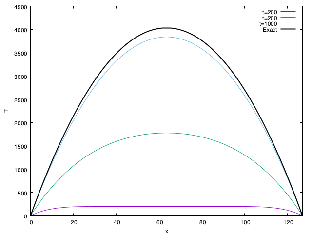
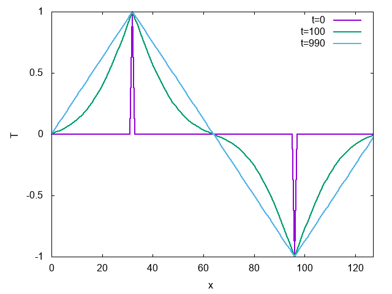

# Day 4 : 領域分割による非自明並列

## 非自明並列

Day 3では自明並列を扱ってきた。自明並列は別名「馬鹿パラ」と呼ばれ、馬鹿にされる傾向にあるのだが、並列化効率が高いため、「計算資源は」最も有効に使える計算方法である。さて、「スパコンはノードを束ねたもの」であり、「ノードとは本質的にはPCと同じもの」であることは既に述べた。しかし「普通のPCを多数束ねたらスパコンになるか」というとそうではなく、スパコンとして動作をするためには「ネットワーク」と「信頼性」が重要なのであった。実は、馬鹿パラは「ネットワーク」と「信頼性」のどちらも必要としない。


パラメタ並列の場合、一番最初に「どのパラメタをどのプロセスが担当すべきか」をばらまくのに通信したあとは通信不要である(計算が終わったら結果をファイルに吐いてしまえばよい)。したがって、各ノードが高速なネットワークで接続されている必要はなく、たとえばイーサネットなどでつないでしまって全く問題ない。
また、大規模な非自明並列計算を実行するには高い信頼性が求められるが、馬鹿パラは信頼性も要求しない。計算途中でノードが壊れてしまっても、そのノードでしていた計算だけやり直せばよいだけのことである。
つまり馬鹿パラとは最も計算資源は有効に使えるものの、「ネットワーク」と「信頼性」という、スパコンの重要な特性を全く使わない計算方法なのであった。なので、主に馬鹿パラで計算する場合には、「普通のPCを多数束ねたPCクラスタ」で全く構わない。

さて、馬鹿パラであろうとなんであろうと、スパコンを活用していることにはかわりないし、それで良い科学的成果が出るのならそれで良いのだが、せっかくスパコンを使うのなら、もう少し「スパコンらしさ」を活用してみたい。というわけで、「ネットワーク」と「信頼性」をどちらも要求する **非自明並列 (non-trivial parallel)** に挑戦してみよう。

馬鹿パラではほとんど通信が発生しなかったのに対して、非自明並列は頻繁に通信が必要とする。
科学計算はなんらかの繰り返し計算(例えば時間発展)をすることが多いが、意味のある並列計算を行う場合、毎ステップ通信が必要となる。この時、「計算に関わる全ノードと毎回通信が発生する」タイプと、「論理的に距離が近いノードのみと通信が必要となる」タイプにわかれる。


毎回全ノードと計算が必要になるタイプは、典型的には高速フーリエ変換が必要となる場合である。
例えば、「円周率を一兆桁計算する」といった計算において、多倍長計算が必要となり、その多倍長計算の実行にフーリエ変換が使われる。乱流の計算にもフーリエ変換が使われる。以上、地球シミュレータで大規模な乱流シミュレーションが行われたが、これは地球シミュレータの強力なネットワークがなければ実現が難しかった。こういう全ノード通信は、バタフライ型のアルゴリズムで実行されることが多いが、ここでは深入りしない。興味のある人は「並列FFT」などでググってみて欲しい。

それに対して、「近いノードのみ」と通信が必要となるタイプは、典型的には領域分割による並列化にあらわれる。領域分割とは、「計算したい領域」をプロセス数で分割して、隣接する領域で必要となる情報を通信しながら計算を実行するような並列化である。うまくプロセスを配置しないと、論理的には近い領域が、物理的には遠いノードに配置されたりして効率が悪くなるので注意したい。

とりあえず図を見て、「全体通信の方が大変そうだな」と思うであろう。基本的には、計算量に対して通信量、通信頻度が低いほど並列化が楽になる(効率が出しやすい)。計算コストと通信コストの比を「粒度」と呼ぶこともある(後で説明するかもしれないし、しないかもしれない)。

とりあえずここでは非自明並列の例として、領域分割をやってみる。

## 一次元拡散方程式 (シリアル版)

領域分割による並列化の題材として、一次元拡散方程式を考えよう。
これは熱を加えられたり冷やされたりした物質の温度がどう変化していくかを表す方程式である。
時刻$t$、座標$x$における温度を$T(x,t)$とすると、熱伝導度を$\kappa$として、

$$
\frac{\partial T}{\partial t} = \kappa \frac{\partial^2 T}{\partial x^2}
$$

で表される。この方程式の定常状態は、時間微分がゼロとなる状態で与えられるから、

$$
\kappa \frac{\partial^2 T}{\partial x^2} = 0
$$

ある関数の二回微分がゼロなので、解は二次関数か一次関数で与えられることがわかりますね。
ちなみに一般の時刻における解はフーリエ変換で求められる。理工系の大学生であれば二年生くらいまでで習っているはずなので
各自復習されたい。

さて、この偏微分方程式を数値的に解くために空間を$L$分割して差分化しよう。
時間については一次のオイラー法、空間については中央差分を取ると、時間刻みを$h$、
$n$ステップ目に$i$番目のサイトの温度を$T_i^{n}$として、

$$
T_i^{n+1} = T_i^{n} + \frac{T_{i+1}^n - 2 T_{i}^n T_{i-1}^n}{2h}
$$

で得られる。例えば時間ステップ$n$の温度を`std::vector<double> lattice`で表すと、上記の式をそのままコードに落とすと

```cpp
  std::copy(lattice.begin(), lattice.end(), orig.begin());
  for (int i = 1; i < L - 1; i++) {
    lattice[i] += (orig[i - 1] - 2.0 * orig[i] + orig[i + 1]) * 0.5 * h;
  }
```

と書ける。らくちんですね。これだと両端(`lattice[0]`と`lattice[L-1]`)が更新されないので、周期境界条件を課しておく。以上を、1ステップ時間を進める関数`onestep`として実装しよう。

```cpp
void onestep(std::vector<double> &lattice, const double h) {
  static std::vector<double> orig(L);
  std::copy(lattice.begin(), lattice.end(), orig.begin());
  for (int i = 1; i < L - 1; i++) {
    lattice[i] += (orig[i - 1] - 2.0 * orig[i] + orig[i + 1]) * 0.5 * h;
  }
  // For Periodic Boundary
  lattice[0] += (orig[L - 1] - 2.0 * lattice[0]  + orig[1]) * 0.5 * h;
  lattice[L - 1] += (orig[L - 2] - 2.0 * lattice[L - 1] + orig[0]) * 0.5 * h;
}
```

これで数値計算部分はおしまい。ついでに、系の状態をファイルにダンプする関数も書いておこう。

```cpp
void dump(std::vector<double> &data) {
  static int index = 0;
  char filename[256];
  sprintf(filename, "data%03d.dat", index);
  std::cout << filename << std::endl;
  std::ofstream ofs(filename);
  for (int i = 0; i < data.size(); i++) {
    ofs << i << " " << data[i] << std::endl;
  }
  index++;
}
```

あとは適当な条件を与えれば時間発展させることができる。ここでは、「一様加熱」と「温度固定」の二通りを試してみよう。コードはこちら。

[thermal.cpp](thermal.cpp)


一様加熱というのは、系のすべての場所を一様に加熱することである。
単位時間あたりの加熱量を`Q`として、

```cpp
    for (auto &s : lattice) {
      s += Q * h;
    }
```

とすれば良い。ただしこのままでは全体が熱くなってしまうので、棒の両端の温度を0に固定しよう。

```cpp
    lattice[0] = 0.0;
    lattice[L - 1] = 0.0;
```

計算部分はこんな感じにかける。

```cpp
void uniform_heating(std::vector<double> &lattice) {
  const double h = 0.2;
  const double Q = 1.0;
  for (int i = 0; i < STEP; i++) {
    onestep(lattice, h);
    for (auto &s : lattice) {
      s += Q * h;
    }
    lattice[0] = 0.0;
    lattice[L - 1] = 0.0;
    if ((i % DUMP) == 0) dump(lattice);
  }
}
```

何ステップかに一度、系の状態をファイルに吐いている。
定常状態は、両端がゼロとなるような二次関数、具体的には

$$
T(x) = -x (x-L)
$$

となる。二次関数で、両端がゼロとなること、これが熱伝導方程式の解になっていることを確認しよう。

計算結果はこんな感じになる。



時間がたつにつれて温度が上がっていき、定常状態に近づいていくのがわかる。

この例では、周期境界条件がちゃんとできているか確認できないので、温度が境界をまたぐような条件、「温度固定」を試してみよう。リング状の金属の棒の、ある点を高温に、反対側を低温に固定する。すると、定常状態は、高温と低温を結ぶ直線になる。

計算部分はこんな感じに書けるだろう。

```cpp
void fixed_temperature(std::vector<double> &lattice) {
  const double h = 0.01;
  const double Q = 1.0;
  for (int i = 0; i < STEP; i++) {
    onestep(lattice, h);
    lattice[L / 4] = Q;
    lattice[3 * L / 4] = -Q;
    if ((i % DUMP) == 0) dump(lattice);
  }
}
```

計算結果はこんな感じ。



時間がたつにつれて、定常状態である直線になる。ちなみに、定常状態で温度勾配が直線になる現象は[フーリエの法則](https://ja.wikipedia.org/wiki/%E7%86%B1%E4%BC%9D%E5%B0%8E#%E3%83%95%E3%83%BC%E3%83%AA%E3%82%A8%E3%81%AE%E6%B3%95%E5%89%87)という名前がついている。あのフーリエ変換のフーリエさんである。もともとフーリエは熱伝導の問題を解くためにフーリエ級数を編み出したのであった。

## 一次元拡散方程式 (並列版)

さて、一次元拡散方程式のシミュレーションコードがかけたところで、これを並列化しよう。
並列化の方法としては領域分割を採用する。
要するに空間をプロセスの数で分割して、各プロセスは自分の担当する領域を、必要に応じて隣のプロセスから情報をもらいながら更新すればよい。
ただし、隣の領域の情報を参照する必要があるので、その部分を「のりしろ」として保持し、そこを通信することになる。

並列化で考えなければいけないことの一つに「ファイル出力をどうするか」というものがある。これまでプロセスが一つしかなかったので、そいつがファイルを吐けばよかったのだが、プロセス並列をしていると、別々のプロセスがそれぞれ系の状態を分割して保持している。どうにかしてこれをファイルに吐かないといけない。並列計算をする前に、まずは領域分割をして、各プロセスが別々に保持している状態をどうやってファイルに吐くか考えてみよう。いろいろ方法はあるだろうが、とりあえず「全プロセス勝手に吐くく」「一つのファイルに追記」「一度まとめてから吐く」の三通りの方法が考えられる。


1. 「全プロセス勝手に吐く」これは各プロセスが毎ステップ勝手にファイルを吐く方法。例えばtステップ目にi番目のプロセスが`file_t_i.dat`みたいな形式で吐く。コーディングは楽だが、毎ステップ、プロセスの数だけ出力されるので大量のファイルができる。また、解析のためには各プロセスが吐いたファイルをまとめないといけないのでファイル管理が面倒。
2. 「一つのファイルに追記」毎ステップ、ファイルをひとつだけ作成し、プロセスがシリアルに次々と追記していく方法。出力されるファイルはシリアル実行の時と同じなので解析は楽だが、「追記」をするためにプロセスが順番待ちをする。数千プロセスでやったら死ぬほど遅かった。
3. 「一度まとめてから吐く」いちど、ルートプロセス(ランク0番)に通信でデータを集めてしまってから、ルートプロセスが責任を持って一気に吐く。数千プロセスでも速度面で問題なくファイル出力できたが、全プロセスが保持する状態を一度一つのノードに集めるため、数万プロセス実行時にメモリ不足で落ちた。

とりあえずメモリに問題なければ「3. 一度まとめてから吐く」が楽なので、今回はこれを採用しよう。メモリが厳しかったり、数万プロセスの計算とかする時にはなにか工夫してくださいまし。

さて、「一度まとめてから吐く」ためには、「各プロセスにバラバラにあるデータを、どこかのプロセスに一括して持ってくる」必要があるのだが、MPIには
そのものずばり`MPI_Gather`という関数がある。使い方は以下のサンプルを見たほうが早いと思う。

[gather.cpp](gather.cpp)

```cpp
#include <cstdio>
#include <mpi.h>
#include <vector>

const int L = 8;

int main(int argc, char **argv) {
  MPI_Init(&argc, &argv);
  int rank, procs;
  MPI_Comm_rank(MPI_COMM_WORLD, &rank);
  MPI_Comm_size(MPI_COMM_WORLD, &procs);
  const int mysize = L / procs;
  // ローカルなデータ(自分のrank番号で初期化)
  std::vector<int> local(mysize, rank);
  // 受け取り用のグローバルデータ
  std::vector<int> global(L);
  // 通信(ランク0番に集める)
  MPI_Gather(local.data(), mysize, MPI_INT, global.data(), mysize, MPI_INT, 0,  MPI_COMM_WORLD);

  // ランク0番が代表して表示
  if (rank == 0) {
    for (int i = 0; i < L; i++) {
      printf("%d", global[i]);
    }
    printf("\n");
  }
  MPI_Finalize();
}
```

これは、長さ`L=8`のデータを、それぞれのプロセスが`mysize = L/procs`個ずつ持っている、という状況を模している。
それぞれのプロセスが保持するデータは`local`に格納されている。これらはそれぞれ自分のランク番号で初期化されている。
これを全部ランク0番に集め、`global`で受け取って表示する、というコードである。

実行結果はこんな感じ。

```sh
$ mpic++ gather.cpp
$ mpirun -np 1 ./a.out
00000000

$ mpirun -np 2 ./a.out
00001111

$ mpirun -np 4 ./a.out
00112233

$ mpirun -np 8 ./a.out
01234567
```

1分割から8分割まで試してみた。これができれば、一次元熱伝導方程式の並列化は難しくないだろう。
全データをまとめた後は、そのデータをシリアル版のファイルダンプに渡せば良いので、こんな関数を書けば良い。

```cpp
void dump_mpi(std::vector<double> &local, int rank, int procs) {
  static std::vector<double> global(L);
  MPI_Gather(&(local[1]), L / procs, MPI_DOUBLE, global.data(), L / procs, MPI_DOUBLE, 0,  MPI_COMM_WORLD);
  if (rank == 0) {
    dump(global);
  }
}
```

各プロセスは`local`という`std::vector`にデータを保持しているが、両端に「のりしろ」があるので、そこだけ除いたデータをまとめて
`global`という`std::vector`に受け取り、ランク0番が代表してシリアル番のダンプ関数`dump`を呼んでいる。

ファイル出力の目処がついたところで、並列化を考えよう。差分方程式なので、両端にそれぞれ1サイト分の「のりしろ」を用意して、
そこだけ隣と通信すれば良い。


計算をする「前」に、両脇の領域を管轄するプロセスから端の情報を「のりしろ」にコピーして、その後は普通に計算すれば良い。
端の情報を「のりしろ」にコピーするのには一対一通信を用いる。
MPIの基本的な一対一通信関数として、`MPI_Send`による送信と`MPI_Recv`による受信が用意されているが、
それらをペアで使うより、送受信を一度にやる`MPI_Sendrecv`を使った方が良い。`MPI_Send`と`MPI_Recv`を使うと
デッドロックの可能性がある上に、一般には`MPI_Sendrecv`の方が性能が良いためだ。
というわけで、並列化した計算コードはこんな感じになる。

```cpp
void onestep(std::vector<double> &lattice, double h, int rank, int procs) {
  const int size = lattice.size();
  static std::vector<double> orig(size);
  std::copy(lattice.begin(), lattice.end(), orig.begin());
  // ここから通信のためのコード
  const int left = (rank - 1 + procs) % procs; // 左のランク番号
  const int right = (rank + 1) % procs; // 右のランク番号
  MPI_Status st;
  // 右端を右に送って、左端を左から受け取る
  MPI_Sendrecv(&(lattice[size - 2]), 1, MPI_DOUBLE, right, 0, &(orig[0]), 1, MPI_DOUBLE, left, 0, MPI_COMM_WORLD, &st);
  // 左端を左に送って、右端を右から受け取る
  MPI_Sendrecv(&(lattice[1]), 1, MPI_DOUBLE, left, 0, &(orig[size - 1]), 1, MPI_DOUBLE, right, 0, MPI_COMM_WORLD, &st);

  //あとはシリアル版と同じ
  for (int i = 1; i < size - 1; i++) {
    lattice[i] += (orig[i - 1] - 2.0 * orig[i] + orig[i + 1]) * 0.5 * h;
  }
}
```

コードのコメントの通りで、難しいことはないと思う。`MPI_Sendrecv`で「データを送るプロセス」と「データを受け取るプロセス」が違うことに注意。
クリスマスパーティのプレゼント交換の時のように、みんなで輪になって、右の人にプレゼントを渡し、左の人からプレゼントを受け取る、みたいなイメージである。
もちろん「右に渡して右から受け取る」という通信方式でも良いが、「右に渡して左から受け取る」方がコードが楽だし、筆者の経験ではそっちの方が早かった。

計算部分ができたので、あとは条件を追加すれば物理的なシミュレーションができる。
まずは一様加熱。

```cpp
void uniform_heating(std::vector<double> &lattice, int rank, int procs) {
  const double h = 0.2;
  const double Q = 1.0;
  for (int i = 0; i < STEP; i++) {
    onestep(lattice, h, rank, procs);
    for (auto &s : lattice) {
      s += Q * h;
    }
    if (rank == 0) {
      lattice[1] = 0.0;
    }
    if (rank == procs - 1) {
      lattice[lattice.size() - 2] = 0.0;
    }
    if ((i % DUMP) == 0) dump_mpi(lattice, rank, procs);
  }
}
```

シリアル版とほぼ同じだが、「両端の温度を固定」する時に、左端はランク0番が、右端は`procs-1`版が担当しているので、そこだけif文が入る。
あとは`dump`を`dump_mpi`に変えるだけ。

次に、温度の固定条件。

```cpp
void fixed_temperature(std::vector<double> &lattice, int rank, int procs) {
  const double h = 0.01;
  const double Q = 1.0;
  const int s = L / procs;
  for (int i = 0; i < STEP; i++) {
    onestep(lattice, h, rank, procs);
    if (rank == (L / 4 / s)) {
      lattice[L / 4 - rank * s + 1] = Q;
    }
    if (rank == (3 * L / 4 / s)) {
      lattice[3 * L / 4 - rank * s + 1] = -Q;
    }
    if ((i % DUMP) == 0) dump_mpi(lattice, rank, procs);
  }
}
```

これも一様加熱と同じで、「温度を固定している場所がどのプロセスが担当するどの場所か」を調べる必要があるが、それを考えるのはさほど難しくないだろう。

そんなわけで完成した並列コードがこちら。

[thermal_mpi.cpp](thermal_mpi.cpp)

せっかく並列化したので、高速化したかどうか調べてみよう。一様加熱の計算をさせてみる。

まずはシリアル版の速度。

```sh
$ clang++ -O3 -std=c++11 thermal.cpp
$ time ./a.out
data000.dat
data001.dat
(snip)
data099.dat
./a.out  0.05s user 0.12s system 94% cpu 0.187 total
```

次、並列版。

```sh
$ time mpirun -np 2 --oversubscribe ./a.out
data000.dat
data001.dat
(snip)
data099.dat
mpirun -np 2 --oversubscribe ./a.out  0.42s user 0.16s system 176% cpu 0.330 total

$ time mpirun -np 4 --oversubscribe ./a.out
data000.dat
data001.dat
(snip)
data099.dat
mpirun -np 4 --oversubscribe ./a.out  1.73s user 0.88s system 234% cpu 1.116 total

$ time mpirun -np 8 --oversubscribe ./a.out
data000.dat
data001.dat
(snip)
data099.dat
mpirun -np 8 --oversubscribe ./a.out  3.28s user 2.89s system 311% cpu 1.980 total
```

うん、無事に並列数を上げるほど遅くなった。

~~YA・TTA・NE☆~~

まぁ、サイズが小さいし、一次元だから計算もとても軽いので、通信のために余計なことをする分遅くなることは実は予想できていた。しかし、領域分割の基本的なテクニックはこのコードにすべて含まれているし、これができれば原理的には差分法で陽解法なコードは全部並列化できてしまうので、応用範囲は広い。