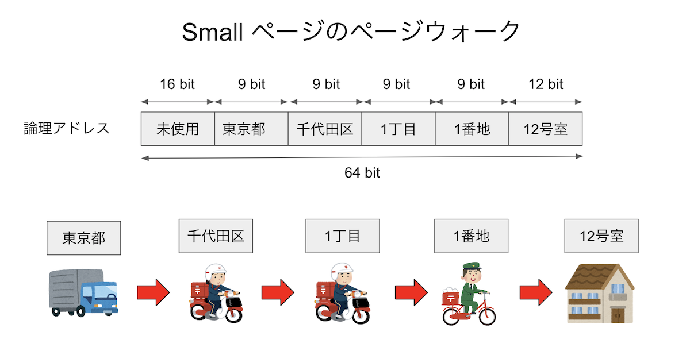
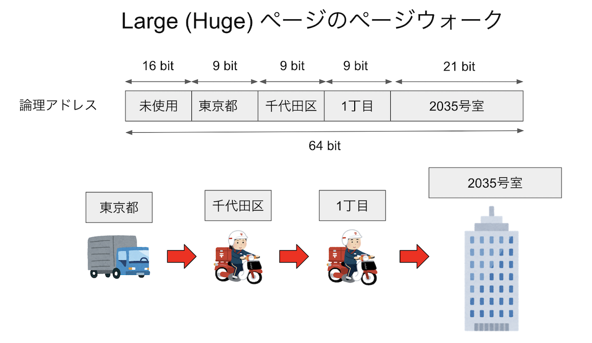
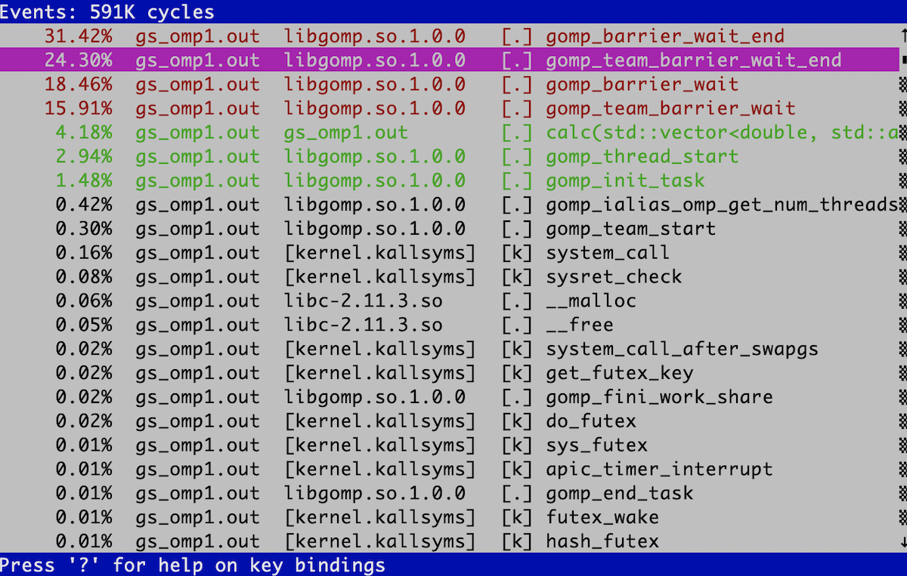
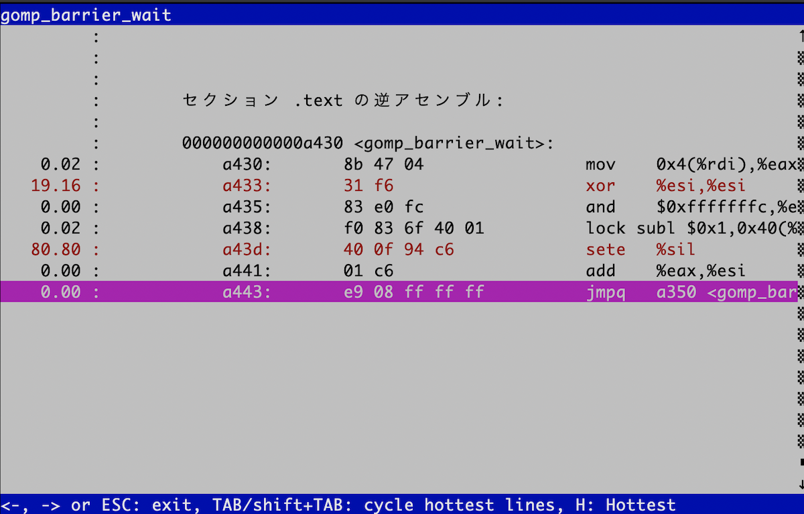

# Day 6 : ハイブリッド並列

## ハイブリッド並列とは

これまで、並列化の手段としてMPIを使った「プロセス並列」を行ってきた。
最初に述べたように、並列化には他にも「スレッド並列」という手段がある。
プロセス並列が分散メモリ型、スレッド並列が共有メモリ型であり、
スレッド並列だけではノードをまたぐことができないので、普通「スパコンを使う」
というとプロセス並列が必須になる。
さて、MPIを使ったプロセス並列「だけ」による並列化を「flat-MPI」と呼ぶ。
一方、プロセス並列とスレッド並列を併用する並列化を「ハイブリッド並列」と呼ぶ。
当然のことながら、ハイブリッド並列は、プロセス並列単体、スレッド並列単体よりも
面倒になるので、できることならやりたくない。しかし、アプリケーションや
サイズによっては、ハイブリッド並列を選択せざるを得ない場合もあるだろう。
ここでは、スレッド並列を行うときの注意点や、ハイブリッド並列の実例について見てみよう。

## 仮想メモリとTLB

さて、プロセス並列ではあまり気にしなくてよかったが、スレッド並列を行う時には
気にしなければいけないものとして「NUMA」というものがある。
「NUMA」を気にするためには、仮想メモリについて知らないといけない。
というわけで、仮想メモリについて見てみよう。

OSは実に様々なことをやっているが、特に重要な仕事に「メモリ管理」がある。
物理的には「メモリ」はマザーボードに刺さったDRAMを指すが、
OSの管理下で動くプロセスから見える「メモリ」は、それを仮想化したものである。
プロセスにとっては連続に見えるメモリも、実はDRAM上にバラバラに割り付けられて
いるかもしれない。OSは、「プロセスから見えるアドレス」と「物理的にDRAMに割り当てられたアドレス」を
うまいこと変換して、プロセスが物理メモリを意識しないで済むようにしている。
このような仕組みを「仮想メモリ (virtual memory)」と呼ぶ。
仮想メモリを扱う利点としては、

* OSがメモリを管理してくれるので複数のプロセスがお互いのメモリを気にしなくて良くなる(セキュリティ上も好ましい)
* 物理的には不連続であっても、プロセスから見ると連続アドレスに見えるようにできる
* メモリが足りない時にハードディスクなどにスワップすることで、物理メモリより大きな論理メモリ空間がとれる

などが挙げられる。なお、Windowsでは「ハードディスクにスワップする領域の上限」のことを「仮想メモリ」と呼んでいるようなので注意。

実際に、プロセスごとに固有の仮想メモリが与えられているのを見てみよう。こんなコードを書いてみる。

[vmem.cpp](vmem.cpp)

```cpp
#include <cstdio>
#include <mpi.h>

int rank;

int main(int argc, char **argv) {
  MPI_Init(&argc, &argv);
  MPI_Comm_rank(MPI_COMM_WORLD, &rank);
  printf("rank = %d, address = %x\n", rank, &rank);
  MPI_Finalize();
}
```

これは、`int`型の変数`rank`の値とアドレスを表示するコードである。
関数の中に入れるとスタック内のアドレスになってしまうので(まぁそれでもいいんだけど)、
グローバル変数として宣言してある。これを **Linux** で実行するとこんな感じになる。

```sh
$ mpic++ vmem.cpp  
$ mpirun -np 4 ./a.out
rank = 0, address = 611e64
rank = 1, address = 611e64
rank = 3, address = 611e64
rank = 2, address = 611e64
```

すべて同じアドレスであるにもかかわらず、値が異なるのがわかるだろう。
これは、4プロセス立ち上がったそれぞれから「見える」アドレス空間が、物理的には異なる
アドレスに割り当てられているからである。

なお、上記のコードをMacで実行するとこうなる。

```sh
$ mpirun -np 4 --oversubscribe ./a.out
rank = 1, address = cae26d8
rank = 2, address = fe426d8
rank = 3, address = ff4c6d8
rank = 0, address = 40c36d8
```

論理的には同じ場所にあるはずの`rank`が、てんでバラバラのアドレスにあることがわかる。
これは、Mac OSXが「アドレス空間ランダム化(Address Space Layout Randomization, ASLR)」と呼ばれる
セキュリティ技術を採用しているからである。ディストリビューションによってはLinuxでもこれをやっているかもしれない。
まぁそれはさておき。

話の本筋からはやや外れるのだが、せっかく仮想メモリの話が出たので、合わせてTLBの話もしておこう。
OSは、プロセスから見える「論理アドレス」と、実際にDRAMに割り当てる「物理アドレス」は、「ページ」と
呼ばれる単位で管理している。メモリをある程度のまとまりごとにわけ、それを「ページ」と呼ぶ。
論理アドレスと物理アドレスの対応は「ページテーブルエントリ (PTE)」と呼ばれ、それをまとめたデータを「ページテーブル」と呼ぶ。
プロセスからメモリのアクセス要求があったら、ページテーブルを見てプロセスの論理アドレスから物理アドレスに変換してやる必要がある。
ページサイズを調べるには`getconf`を使う。

```sh
$ getconf PAGESIZE
4096
```

一般に、ページサイズは4096 Byteに取ることが多い。すると、[1GBのメモリは26万2144個のPTEで管理される](http://ascii.jp/elem/000/000/567/567889/)ことになる。これだけの数をキャッシュに乗せるのは不可能であるため、基本的にはページテーブルはメモリ上に置かれる。すると、メモリにアクセスする際にキャッシュミスをすると、まず論理アドレスを物理アドレスに変換するためにメモリにアクセスし、物理アドレスがわかったらそのアドレスにアクセス、とメモリアクセスが二回発生してしまう。これを防ぐために、一度アクセスしたPTEを記憶する、特別なキャッシュが用意されている。これがTLB (Translation Lookaside Buffer)である。これもキャッシュの一種であるため、キャッシュのようにL1、L2のような階層構造を持っている。キャッシュの大きさはバイト数で指定されるが、TLBはエントリ数で指定される。TLBの情報を見るには`x86info`が便利だ。
CentOSなら、

```sh
sudo yum install x86info
```

で入る。他のパッケージにもだいたい入っていると思う。キャッシュの情報を見るには`-c`を指定する。
以下は Intel Xeon Gold 6130 (Skylake)上で実行した結果である。

```txt
x86info v1.31pre
Found 32 identical CPUs
Extended Family: 0 Extended Model: 5 Family: 6 Model: 85 Stepping: 4
Type: 0 (Original OEM)
CPU Model (x86info's best guess): Core i7 (Skylake-X)
Processor name string (BIOS programmed): Intel(R) Xeon(R) Gold 6130 CPU @ 2.10GHz

Cache info
 L1 Data Cache: 32KB, 8-way associative, 64 byte line size
 L1 Instruction Cache: 32KB, 8-way associative, 64 byte line size
 L2 Unified Cache: 1024KB, 16-way associative, 64 byte line size
 L3 Unified Cache: 22528KB, 11-way associative, 64 byte line size
TLB info
 Instruction TLB: 2M/4M pages, fully associative, 8 entries
 Instruction TLB: 4K pages, 8-way associative, 128 entries
 Data TLB: 1GB pages, 4-way set associative, 4 entries
 Data TLB: 4KB pages, 4-way associative, 64 entries
 Shared L2 TLB: 4KB/2MB pages, 6-way associative, 1536 entries
 64 byte prefetching.
Total processor threads: 32
This system has 2 eight-core processors with hyper-threading (2 threads per core) running at an estimated 2.10GHz
```

キャッシュの構造について知っている人なら、命令用TLBとデータ用TLBが分けられていたり、L1、L2の区別があり、L2は命令用とデータ用が共通になっているなど、キャッシュと同じような構造をしていることがわかるだろう。さて、一番大きなTLBでも、エントリ数は1536しかない。デフォルトでは1ページが4KBなので、これをフルに活用しても、6MBちょっとのメモリ空間しか管理できない。したがってそれより大きなデータを扱う場合にはTLBミスが起きることになる。
しかし、先程の表示で`Shared L2 TLB: 4KB/2MB pages`と書いてあったように、このTLBは2MBのページを管理することもできる。1ページを2MBにすれば、1536エントリで3GBのメモリ空間をカバーすることができる。このように、通常より大きなサイズのページを使うことを**ラージページ (Large Page)**、もしくは **ヒュージページ (Huge Page)** と呼ぶ。ラージページのサイズは`meminfo`で確認できる。

```sh
$ cat /proc/meminfo  |grep Hugepagesize
Hugepagesize:       2048 kB
```

確かに2MBになっていることがわかる。ラージページを使うことで、TLBミスの低減が期待できるが、メモリの最小管理サイズが大きくなるため、メモリの利用に無駄が多くなり、実質的にメモリ使用量が増える。また、**ラージページはスワップアウトされない**ということも覚えておくと良い。仮想メモリでは、メモリが足りなくなるとページ単位でディスクにメモリを逃がすスワッピングを行うが、ラージページはスワップされない。もしラージページをスワップアウト(ディスクへの書き出し)した場合、あとで必要になってスワップイン(メモリへの読み戻し)する時に、ラージページのサイズだけ**連続した物理メモリ**を用意してやる必要があるが、断片化などによりそれが保証できないためである。

## 余談：TLBミスについて



TLBもキャッシュの一種であるから、通常のキャッシュと同様にキャッシュミスを起こす。最近はメモリ空間が大きくなったため、ページテーブルは多段階で管理されている。現在の一般的なマシンは64 bitなので、理論的には16 エクサバイトのメモリ空間を表現できる(正確にはEiB、つまりエクスビバイトだがそれはさておく)。しかし、現実にはそんなに大きなメモリ空間は(まだ)実現できないため、48 bitで256 テラバイトを表現する。現在のx86は、この48ビットの論理アドレスを5つの部分にわける。最下位の12ビットが、ページ内のどの場所にあるかを表すオフセットである。12ビット、すなわち4096バイトがページサイズとなる。その上位の9ビットを4セットが、ページの「住所」を表す。例えばそれぞれ「東京都」「千代田区」「一丁目」「一番地」といった具合である。イメージとしては、最初の4つで建物を指定し、最後のオフセットが部屋番号だと思えば良い。いま、「住所(論理アドレス)」が与えられた時、その住所が示す地球上での座標(物理アドレス)を探すことを考える。まず、都道府県の対応表(ページテーブル)を見て「東京」がどこにあるかを調べ、次に都内で「千代田区」がどこにあるかを調べ・・・と、4段階の検索を行って、ようやく論理アドレスと物理アドレスが対応付けられる。こうして、ページテーブルをたどっていって物理アドレスを解決することを **ページウォーク** と呼ぶ。また、ラージページを扱う場合には、最後の9ビットもオフセットとして用いる。するとページサイズを表すビット数が12+9=21ビットとなり、ページサイズが2**21=2097152、つまり2MiBとなることがわかる。住所の階層を一段階「粗く」して、その分最後の家を超高層ビルにしたようなイメージである。



いずれにせよ、ページウォークは時間がかかる作業であるため、一度調べたページテーブルエントリをキャッシュしたくなる。これがTLBであった。CPUはキャッシュと同様にハードウェアとしてTLBを持っている。一般にTLBミスはページウォークを伴うためにコストが高い。しかし、TLBミスが頻繁に起きるということは、TLBエントリ数に比べてずっと多い数のページをプログラムが触っている、ということである。これは使用メモリの局所性が低いことを意味するから、一緒にキャッシュミスも起きている可能性が高い。頻繁にキャッシュミスを起こしていれば性能は全くでないため、通常はそっちの方が問題になることが多く、それを解決すればTLBミスも一緒に減ることが多い(気がする)。しかし、現実にはキャッシュはあまり問題を起こしていないのに、TLBミスが深刻な影響を与えることがたまにある。

かなりアドバンストな話題となるが、キャッシュは、ハッシュのような仕組みでデータを保存している。大雑把にいえば論理アドレスからハッシュ値を作り、そのハッシュ値によってキャッシュのどこにそのメモリを置くかを決める。したがって、メモリの別々の場所にあるにもかかわらず、ハッシュ値がぶつかるためにキャッシュ上の場所が同じになってしまうことがある。そして、運悪くそのデータを交互にアクセスするようなプログラムになっていると、キャッシュのサイズには余裕があるにもかかわらず、同じデータをキャッシュインしてはキャッシュアウトすることを繰り返し、性能が極端に劣化してしまう。これを **キャッシュスラッシング** と呼ぶ。
多次元配列なんかを扱っていて、その次元を変えたとき、あるサイズだけ極端に性能が劣化したりした場合は、このキャッシュスラッシングが起きている可能性が高い。

さて、TLBもキャッシュであるから、全く同様な原理でスラッシングが起きる。これをTLBスラッシングと呼ぶ。個人的な経験だが、とあるサイトで自分のコードがflat-MPIでは全く問題なく高並列で性能がでるのに、ハイブリッドにすると全く等価な計算をしているにもかかわらず高並列実行時に性能ブレが発生し、結果としてかなり性能が劣化してしまう、ということが起きた。その原因究明のために不要なルーチンを削って「犯人探し」をしていると、最終的に**全く呼ばれていない関数を含むオブジェクトファイルをリンクすると性能が劣化、リンクしないと劣化しない**という状況になった。繰り返すが、「使っていない関数を含むオブジェクトファイルをリンクするかどうか」で、性能が20%近くもぶれてしまうのである。flat-MPIの場合にはこれは起きず、ハイブリッド並列の時だけ起きた。
結局、これはTLBスラッシングが起きていたためとわかり、ページサイズを変えることで性能劣化が抑えられたのだが、今でも「なぜハイブリッドだとTLBスラッシングが起きたのか」はよくわかってない。あのGotoBLASで有名な後藤さんも、いくつかの論文で行列積におけるTLBの影響が大きいことを指摘している。

* [On Reducing TLB Misses in Matrix Multiplication (2002) by Kazushige Goto and Robert van de Geijn](http://citeseerx.ist.psu.edu/viewdoc/summary?doi=10.1.1.12.4905)
* [Anatomy of high-performance matrix multiplication](https://dl.acm.org/citation.cfm?doid=1356052.1356053)

他にもハイブリッド実行時に性能ブレが発生し、結果として並列性能が劣化するのだが、その原因としてTLBミスが疑わしい場合が結構あるらしい。そのあたり、TLBの扱いをハードウェアでどう扱っているか、またマルチスレッドのとき、マルチプロセスのときにどうしてるかなど、実装に強く依存しているっぽいので、「どうなってるかよくわからない」というのが筆者の正直な気持ちである。

なお、余談の余談となるが、論理アドレスは8バイトアラインされているため、アドレスを2進数表記すると下位3ビットは必ず0となる。glibcのmallocは、これを利用してメモリ(チャンク)の状態を記録する。詳細はkosakiさんによる[malloc動画](https://www.youtube.com/watch?v=0-vWT-t0UHg)、もしくは[mallocの旅(glibc)編](https://www.slideshare.net/kosaki55tea/glibc-malloc)を参照してほしい。

## NUMA

さて、計算ノードは「メモリ」と「CPU」でできているのだが、最近はCPUもマルチコアになったり、
マルチソケットになったりして、ノード内はかなり複雑になっている。


上図では、CPUが4つ搭載されており、それぞれにメモリがつながっている。CPU同士もバスで接続されており、例えば左下のCPUから
右上のメモリにアクセスすることも可能であるが、自分の近くに接続されているメモリにアクセスするよりは
時間がかかってしまう。このように、CPUから見て「近いメモリ」「遠いメモリ」が存在する構成のことを
「非対称メモリアクセス(Non-uniform Memory Access, NUMA)」と呼ぶ。
「NUMA」をなんと呼ぶのが一般的なのかよく知らないのだが、筆者は「ぬ〜ま」と呼んでいる。
他にも「ぬま」や「にゅーま」と発音している人もいる。なぜNUMAが必要となるかはここでは深入りしないので、
気になる人は各自調べて欲しい。

さて、論理メモリは、宣言しただけではまだ物理メモリは割り当てられない。
例えば、以下のような配列宣言があったとする。

```cpp
double a[4096];
```

倍精度実数は一つ8バイトであるため、ページサイズが4096バイトならば、この配列全体で8枚のページを割り当てる必要がある。
しかし、宣言した瞬間には物理メモリは割り当てられない。物理メモリが割り当てられるのは、この配列に始めてアクセスした時である。
はじめて配列に触ったとき、対応するページを物理メモリに割り当てるのだが、その物理メモリは
「触ったスレッドが走っていたコアに一番近いメモリ」が選ばれる。
これを「ファーストタッチの原則」と呼ぶ。一度物理メモリが割り当てられたら、開放されるまでずっとそのままである。
したがって、そこから遠いコアで走るスレッドが触りにいったら時間がかかることになる。

flat-MPIをやっている場合は、各プロセスごとに独立な論理メモリを持っているため、原則として、あるプロセス(のメインスレッド)が
触ったページを、他のスレッドが触りにくる可能性はない(ここではプロセスマイグレーションなどは考えていない)。
しかし、スレッド並列をしている場合には「最初に触ったスレッドと、計算をするスレッドが異なる可能性」がある。


これが問題となるのは「初期化処理は軽いから」と、大きな配列の初期化をメインスレッドでやって、
全てのページがメインスレッドの近くに割り当てられてしまい、いざ重い処理をしようとしたら
すべてのスレッドから「メインスレッドが走るCPU」にデータの要求が来て遅くなる、というパターンである。
これを防ぐには、予め「あとで処理をするスレッド」が「始めてそのページを触るように」してやらないといけない。

## OpenMPの例

さて、いよいよOpenMPによるスレッド並列を行うが、その前にシリアルコードのプロファイルを取ろう。
プロファイルとは、実行コードの性能分析のことで、最も簡単には関数ごとにどこがどれだけ時間を使っているか調べる。
性能分析には`perf`を使うのが良い。残念ながらMacには`perf`相当のツールがなく、同様な目的に使われる`gprof`も正常に動作しないため、
以下では`perf`が使えるLinuxを想定する。実行環境は以下の通り。

* Intel(R) Xeon(R) CPU E5-2680 v3 @ 2.50GHz 12コア x 2ソケット

まず、シリアルコードとしてDay 4で使ったGray Scottモデルの計算を使おう。純粋に計算のみをカウントするため、途中のファイル出力を削除し、また実行時間を測定するようにしたのが[gs.cpp](gs.cpp)である。ただし、デバッグのために最終結果だけファイルに出力している。コンパイルして`perf`でプロファイルをとってみよう。まず、`perf record`で記録を取る。

```sh
$ g++ -O3 -mavx2 -std=c++11 -fopenmp gs.cpp -o gs.out
$ perf record ./gs.out
2527 [ms]
conf000.dat
[ perf record: Woken up 1 times to write data ]
[ perf record: Captured and wrote 0.113 MB perf.data (~4953 samples) ]
```

実行時間が2527 msで、`conf000.dat`を出力したことがわかる。後のためにこれを`conf000.org`か何かにリネームしておこう。
`perf`によって記録されたプロファイルデータは、`perf.data`として保存されている。これは`perf report`で中身を見ることができる。

```sh
perf report
```

環境によるが、こんな画面が出てくる。


いろいろ出てきているが、とりあえずメインの計算ルーチン`calc`が計算時間の99.36%を占めるのを確認すれば良い。
このように一番「重い」関数のことを**ホットスポット(hotspot)**と呼ぶ。ホットスポットが90%以上を占めるような計算コードはチューニングがやりやすい。

さて、一番重い関数はこんな感じになっている。

```cpp
void calc(vd &u, vd &v, vd &u2, vd &v2) {
// (*1) 外側ループ
  for (int iy = 1; iy < L - 1; iy++) {
   // (*1) 内側ループ
    for (int ix = 1; ix < L - 1; ix++) {
      double du = 0;
      double dv = 0;
      const int i = ix + iy * L;
      du = Du * laplacian(ix, iy, u);
      dv = Dv * laplacian(ix, iy, v);
      du += calcU(u[i], v[i]);
      dv += calcV(u[i], v[i]);
      u2[i] = u[i] + du * dt;
      v2[i] = v[i] + dv * dt;
    }
  }
}
```

二重ループになっている。OpenMPは、並列実行したいループの直前にディレクティブを入れて、「このループを並列化してください」と指示することで並列化する。スレッド並列する時には、ループインデックス間に依存性がないか確認しなければならないのだが、今回はたまたまループインデックス間に全く依存関係がないので、好きなように並列化してよい(たまたまというか、そうなるように題材を選んだわけだが)。

まずは内側のループにディレクティブを入れてみよう。`#pragma omp parallel for`というディレクティブを対象ループの直前に入れるだけでよい。

[gs_omp1.cpp](gs_omp1.cpp)

```cpp
void calc(vd &u, vd &v, vd &u2, vd &v2) {
// (*1) 外側ループ
  for (int iy = 1; iy < L - 1; iy++) {
#pragma omp parallel for
    for (int ix = 1; ix < L - 1; ix++) {
      double du = 0;
      double dv = 0;
      const int i = ix + iy * L;
      du = Du * laplacian(ix, iy, u);
      dv = Dv * laplacian(ix, iy, v);
      du += calcU(u[i], v[i]);
      dv += calcV(u[i], v[i]);
      u2[i] = u[i] + du * dt;
      v2[i] = v[i] + dv * dt;
    }
  }
}
```

実行してみよう。スレッド数は環境変数`OMP_NUM_THREADS`で指定する。12コア2ソケットマシンなので、全体で24コアあるから、24スレッドで走らせてみよう。ついでにtimeコマンドをかましてCPUがどれだけ使われているかも見てみる。

```sh
$ time OMP_NUM_THREADS=24 ./gs_omp1.out
24 threads 24078 [ms]
conf000.dat
OMP_NUM_THREADS=24 ./gs_omp1.out  573.12s user 1.72s system 2384% cpu 24.103 total
```

2384%、つまり24コア使われているのは間違いなさそうだが、シリアルコードで2527msだったのが、24078ms、つまり**並列化により10倍遅くなった**ことになる。ついでに結果が正しいことも確認しておこう(**基本！**)。

```sh
diff conf000.org conf000.dat

```

問題なさそうですね。

次に、外側を並列化してみよう。

[gs_omp2.cpp](gs_omp2.cpp)

```cpp
void calc(vd &u, vd &v, vd &u2, vd &v2) {
#pragma omp parallel for
  for (int iy = 1; iy < L - 1; iy++) {
    for (int ix = 1; ix < L - 1; ix++) {
      double du = 0;
      double dv = 0;
      const int i = ix + iy * L;
      du = Du * laplacian(ix, iy, u);
      dv = Dv * laplacian(ix, iy, v);
      du += calcU(u[i], v[i]);
      dv += calcV(u[i], v[i]);
      u2[i] = u[i] + du * dt;
      v2[i] = v[i] + dv * dt;
    }
  }
}
```

同じような計算をしてみよう。

```sh
$ time OMP_NUM_THREADS=24 ./gs_omp2.out
24 threads 411 [ms]
conf000.dat
OMP_NUM_THREADS=24 ./gs_omp2.out  9.16s user 0.02s system 2194% cpu 0.418 total

$ diff conf000.org conf000.dat

```

今度は早くなった。結果も正しいようだ。しかし、24コアを使っているのに、実行速度が6.4倍にしかなっていない。並列化効率にして27%程度である。
ちなみに、12スレッド実行にしても、実行時間がたいして変わらない。

```sh
$ time OMP_NUM_THREADS=12 ./gs_omp2.out
12 threads 410 [ms]
conf000.dat
OMP_NUM_THREADS=12 ./gs_omp2.out  4.91s user 0.01s system 1185% cpu 0.415 total
```

並列数が半分になって、実行時間がたいしてかわらないので、並列化効率も51%にまで改善した。このように、

* 二重ループの内側と外側、どちらを並列化するかで性能が全く変わる。むしろ並列化により遅くなる場合もある。
* スレッドを増やせば増やすほど性能が良くなるわけではない。あるところからスレッドを増やすとむしろ性能が劣化する場合もある。

ということがわかる。

さて、なんで並列化して遅くなったのか見てみよう。まずは内側にディレクティブを入れた場合のコードを、1スレッド実行した場合のプロファイルである。
見やすくするために、`perf report`の結果を`cat`にパイプしよう。`perf report`はデフォルトで結果をTUIインタフェースにより表示する(`--tui`)が、
パイプをつないだ場合には標準出力に結果を流す(`--stdio`)。`--sort`は、ソートするキーを指定する。デフォルトでは関数ごとに表示されるが、`dso`を指定すると、シェアードライブラリごとにまとめてくれる。

```sh
$ OMP_NUM_THREADS=1 perf record ./gs_omp1.out
1 threads 3690 [ms]
conf000.dat
[ perf record: Woken up 1 times to write data ]
[ perf record: Captured and wrote 0.157 MB perf.data (~6859 samples) ]

$ perf report --sort dso | cat
(snip)
# Overhead      Shared Object
# ........  .................
#
    68.91%  gs_omp1.out
    22.04%  [kernel.kallsyms]
     6.51%  libgomp.so.1.0.0
     2.52%  libc-2.11.3.so
     0.03%  [obdclass]
```

「Overhead」が、全体の時間に占める割合だが、自分のプログラムである`gs_omp1.out`が68%しか占めていないことがわかる。
`libgomp.so.1.0.0`はOpenMPの実装である。
同じことをスレッド並列していないコード`gs.out`でやるとこうなる。

```sh
$ perf record ./gs.out
2422 [ms]
conf000.dat
[ perf record: Woken up 1 times to write data ]
[ perf record: Captured and wrote 0.109 MB perf.data (~4758 samples) ]

$ perf report --sort dso | cat
# Overhead      Shared Object
# ........  .................
#
    99.77%  gs.out
     0.21%  [kernel.kallsyms]
     0.02%  [obdclass]
```

つまり、ここで増えた`kernel.kallsyms`とか`libgomp.so.1.0.0`が、スレッド並列化によるオーバーヘッドであることがわかる。
実際、3690 msの68.91%は2542msであり、シリアルコードの実行時間とほぼ同じであることがわかる。

同様なことを外側にディレクティブを入れた場合でやってみると、変なオーバーヘッドがないことがわかる。

```sh
$ OMP_NUM_THREADS=1 perf record ./gs_omp2.out
2342 [ms]
conf000.dat
[ perf record: Woken up 1 times to write data ]
[ perf record: Captured and wrote 0.106 MB perf.data (~4615 samples) ]

$ perf report --sort dso | cat
(snip)
# Overhead      Shared Object
# ........  .................
#
    99.21%  gs_omp2.out
     0.39%  [kernel.kallsyms]
     0.30%  libgomp.so.1.0.0
     0.13%  libc-2.11.3.so
```

内側と外側、それぞれにディレクティブを入れた場合について、スレッド数を増やして行った場合、計算にかかったコストと、それ以外のオーバーヘッドをグラフにした。

内側に入れた場合。


青が実際に計算しているところで、赤がオーバーヘッドである。計算時間は順調に減っているのだが、実行時間のほとんどをオーバーヘッドが占めるという、かなり悲惨なことになっている。

次に、外側にディレクティブを入れた場合。


先程と同様に青が実際に計算しているところで、赤がオーバーヘッドである。スレッド数を増やすほど計算時間は減るが、それに伴ってオーバーヘッドが増えてしまい、12スレッドのところで最も性能が良くなることがわかる。ちなみに先程は12スレッドと24スレッドはほぼ同じ時間だったが、perfをとった時には24スレッドの方が遅くなった。もともとこれだけ計算が軽い場合のスレッド並列は実行時間がかなり揺らぐので、このくらいは誤差の範囲である。

## 性能評価

さて、外側にディレクティブを入れて並列化した場合はそこそこうまくいったが、それでも24スレッド実行時の並列化効率は27%と低い値であった。効率だけ見るとかなり改善の余地がありそうなので、いろいろチューニングをしたくなる。例えばOpenMPには様々なディレクティブがある。ループを

その前にそもそもこの数字が良いのか悪いのか考えて見よう。

そもそも、この計算は全部で20000ステップの計算をしているのであった。シリアルの計算が2422 msなので、1ループあたり120 nsくらいで回っていることになる。
これを24スレッドで理想的に並列化したとすると、ループあたり5 nsしかない。24スレッドが同期するのに平均5nsとしても並列化効率50%である。実際には、24スレッド実行時に計算が平均7ns、同期コストが20ns程度かかっている。12スレッド実行の時には、9.7 ns、同期コストが5.7nsである。計算したのは12コア2ソケットのマシンなので、CPU内12コアの同期に6ns弱、2CPU24コアすべてが同期するのに20nsというのは、まぁ妥当な気がする。ということは、この計算はそもそも同期コストに比べて計算が軽すぎるのが問題なのであって、今後ループ結合やループ分割といった最適化を頑張ったとしても劇的に性能が向上したりする余地はなさそうだな、ということがわかるであろう。

ちなみに、内側を並列化した場合は、さらに外側のループの回転数だけ同期コストが増える。いま`L=128`で、ループの回転数が`L-2`なので、外側を並列化する場合に比べて同期回数が126倍かかる。これはかなりしんどそうだな、ということが想像できる。

ん？並列化効率がものたりない？**だからそういう時はサイズを増やせ！**

というわけで、サイズを一辺二倍にしてみよう。

```sh
$ ./gs.out
10032 [ms]
conf000.dat

$ OMP_NUM_THREADS=12 ./gs_omp2.out
12 threads 1104 [ms]
conf000.dat

$ OMP_NUM_THREADS=24 ./gs_omp2.out
24 threads 1023 [ms]
conf000.dat
```

二次元系なので、計算が単純に4倍重くなった。
同期コストはほぼ変わらないため、相対的に並列化効率は良くなる。この場合は、12スレッドで並列化効率76%、24スレッドで41%である。
サイズを増やせば増やすほど効率が高くなることが想像できよう。

一般論として、スレッド並列において同期コストが見えてしまった時、そのコストをなんとかしようと努力するのは、苦労のわりに実入りが少ない。なので、そういう時には計算するモデルを見直し、同期コストが見えないほど重い計算をすれば良い。繰り返しになるが**並列化効率で困ったらウィースケーリングに逃げてサイズで殴れ！**。せっかく「並列化」という武器を手に入れたのだから、その武器を手に入れる前の敵とばかり戦うのではなく、その武器が最大限輝く敵を探す方が有益である。

本当はOpenMPについてもう少し真面目に、たとえばNUMA最適化やLoop Fusion/Fission/Collapseなども扱おうかと思ったのだが、正直面倒くさくなった。個人的な感想で申し訳ないのだが、ディレクティブベースの最適化はコンパイラが何をやっているかが分かりづらく、隔靴掻痒の感があってどうしても好きになれない。

OpenMPには様々な構文があり、実にいろいろなことができる。OpenMPについてはネットに良い文献が多数落ちているが、例えばIntelによる以下の文献がわかりやすかったので参照されたい。

[インテルコンパイラーOpenMP入門](http://jp.xlsoft.com/documents/intel/compiler/525J-001.pdf)

また、名大の片桐先生による講義資料も詳しいので一読されたい。

[計算科学技術特論 第三回 OpenMPの基礎](http://www.r-ccs.riken.jp/r-ccssite/wp-content/uploads/2017/04/tokuronA_17_3_katagiri_r1.pdf)

## 余談：ロックの話

スレッド数が増えた時に、スレッドの同期コストが問題になると書いた。同期とは「待ち合わせ」のことである。修学旅行などで自由行動があったりするが、次の場所に移動する際には一度集合場所に集まって、全員がそろっているか確認しなければならない。この時、先に集合場所についた人は、後から来る人を待つことになる。この待ち時間が同期コストである。そう思うと、同期待ちの時にはCPUは遊んでいそうな気がするが、実際にほとんど同期待ちでCPUが「遊んでいる」はずのコードをtimeコマンドで実行してみると、

```sh
$ time OMP_NUM_THREADS=24 ./gs_omp1.out
24 threads 24078 [ms]
conf000.dat
OMP_NUM_THREADS=24 ./gs_omp1.out  573.12s user 1.72s system 2384% cpu 24.103 total
```

と、24コアのCPUを2384%使っており、「ほぼ全てのCPUコアが忙しく動いていた」ことがわかる。これが何をやっているのか見てみよう。
`perf report`コマンドは、そのまま実行するとTUIモードになる。「内側」をスレッド並列化し、非常に非効率的になったコードを`perf record`で記録してみよう。

```sh
OMP_NUM_THREADS=24 record ./gs_omp1.out
```

実行が終了したら、`perf report`してみる。こんな画面になるだろう。



`gomp_barrier_wait_end`とか`gomp_team_barrier_wait_end`みたいな、いかにも同期待ち向けの関数が並んでいることがわかる。
`perf`は、関数の内部を見ることができる。まずは`gomp_barrier_wait`を見てみよう。
カーソルキーの上下で目的の関数を選び、エンターを押すと「Annotate gomp_barrier_wait」という項目があるので、それを選ぶ。こんな画面になるはずだ。



非常に単純なコードだが、気になる命令がある。`lock`だ。実は`lock`は命令ではなく、命令のプリフィックスである。「後に続く命令をアトミックにしてください」という修飾語のようなものだ。
`lock`の後には、`inc`や`xchg`、そしてここで出てくる`subl'など、いわゆる「read-modify-write」命令が入る。
「read-modify-write」とは、「メモリから何かを読み出し、修正して、書き戻す」という一連の動作である。普通はこの動作はアトミックにならない。
アトミックとは「不可分である、分けられない」という意味である。アトミックでない場合、この一連の動作の合間に他のスレッドの動作が割り込んでくる可能性がある。
マルチスレッドでこういうことが起きるといろいろ困ることがある。よく言われるのが銀行のATMの例だ。今、100万円の貯金がある口座から、2つのATMからほぼ同時に1万円を
引き出すことを考える。ATMがするべき動作は「銀行残高を読み出し(read)、1万円を引いて(modify)、残額を書き戻す(99万円)」の三つである。
ところが、ATM1とATM2で同時に「銀行残高を読み出し(read)」たとする。ATM1もATM2も残高は100万円だと思っている。そしてそれぞれが「1万円を引いて(modify)、残額を書き戻す(99万円)」という残りの動作を行うと、
合計2万円を引き出したにもかかわらず、残高が99万円になってしまう。こういったことを防ぐために、マルチスレッドをサポートするCPUは
「read-modify-write」の一連の動作をアトミックに行う命令をハードウェアで持っている。この目的でよく使われるのが「compare-and-swap」、いわゆるCAS命令であるが、ここでは深入りしないことにしよう。
ちなみに、例えば[ピーターソンのアルゴリズム](https://ja.wikipedia.org/wiki/%E3%83%94%E3%83%BC%E3%82%BF%E3%83%BC%E3%82%BD%E3%83%B3%E3%81%AE%E3%82%A2%E3%83%AB%E3%82%B4%E3%83%AA%E3%82%BA%E3%83%A0)など、ハードウェアサポートがなくても安全なロックを取る方法も知られているのだが、一般的に遅いので、マルチスレッドの実装にはハードウェアサポートがほぼ必須だと思われる。

さて、さっきの`gomp_barrier_wait`のアセンブリを見てみよう。`libgomp.so`を`objdump`すれば良い。シェアードライブラリの場所は`LD_LIBRARY_PATH`にあるだろうから探してみよう。

```asm
000000000000a430 <gomp_barrier_wait>:
    a430:       8b 47 04                mov    0x4(%rdi),%eax
    a433:       31 f6                   xor    %esi,%esi
    a435:       83 e0 fc                and    $0xfffffffc,%eax
    a438:       f0 83 6f 40 01          lock subl $0x1,0x40(%rdi)
    a43d:       40 0f 94 c6             sete   %sil
    a441:       01 c6                   add    %eax,%esi
    a443:       e9 08 ff ff ff          jmpq   a350 <gomp_barrier_wait_end>
    a448:       0f 1f 84 00 00 00 00    nopl   0x0(%rax,%rax,1)
    a44f:       00
```

ロックを取って、あるメモリの指す値を1減らしたら、`gomp_barrier_wait_end`に飛んでいることがわかる。そこも見てみよう。
`perf`で調べると、「重かった」のはこのループのようだ。

```asm
    a390:       44 8b 07                mov    (%rdi),%r8d
    a393:       41 39 d0                cmp    %edx,%r8d
    a396:       75 20                   jne    a3b8 <gomp_barrier_wait_end+0x68>
    a398:       48 83 c1 01             add    $0x1,%rcx
    a39c:       48 39 f1                cmp    %rsi,%rcx
    a39f:       f3 90                   pause  
    a3a1:       75 ed                   jne    a390 <gomp_barrier_wait_end+0x40>
```

見るとわかると思うが、あるメモリの指す場所を監視して、条件を満たしたらアドレス`a3b8`に飛べ、そうでなければアドレス`a390`(抜き出した場所の先頭)に戻れ、というループである。
つまり、スレッドは同期待ちの間遊んでいるのではなく、条件が満たされるまでひたすらこのこのループを繰り返しているのである。
例えるなら、赤信号で待っているあいだもずっとエンジンをふかしている状態である。
これが「同期待ちで暇そうなのに、なぜかCPUコアが忙しかった理由」である。ここでは「待ち合わせ」でぐるぐる回っていたが、ロックを獲得するのにぐるぐるループでまわる方式を[スピンロック](https://ja.wikipedia.org/wiki/%E3%82%B9%E3%83%94%E3%83%B3%E3%83%AD%E3%83%83%E3%82%AF)と言う。アトミックな「read-modify-write」命令があればスピンロックの実装は簡単である。
詳細は先のWikipediaの記事を参照されたい。
ちなみに、京コンピュータで採用されているCPUはSPARC VIIIfxだが、このCPUにはハードウェアバリアが実装されている。
どんな実装になっているか詳しくは知らないのだが、スピンロックなどのソフトウェア実装に比べて[10倍以上高速](http://www.fujitsu.com/downloads/JP/archive/imgjp/jmag/vol63-3/paper04.pdf)とのことである。
先程見たように、「計算が軽い」ループでは、同期コストが見えてきてしまう。ハードウェアバリアにより同期コストが減ると、その分だけ計算が軽くてもスケールしやすくなるため、プログラマとしてはありがたい。

## ハイブリッド並列の実例

TODO: ハイブリッド版の性能測定