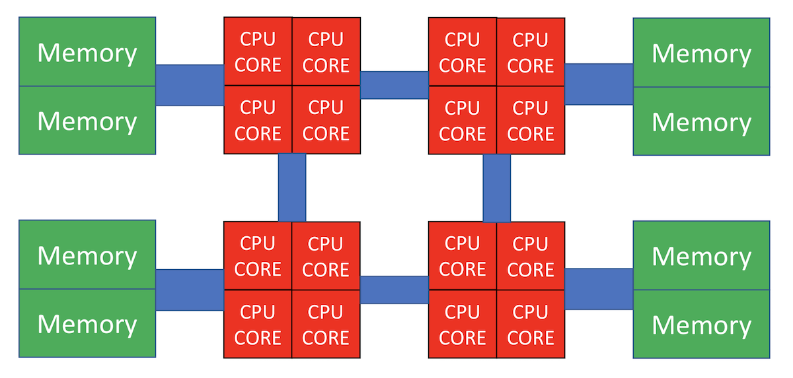
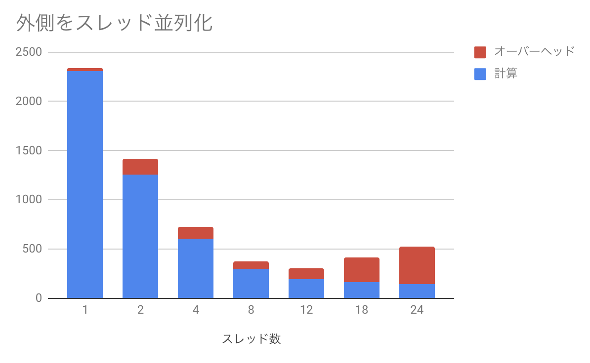

# Day 6 : ハイブリッド並列

## ハイブリッド並列とは

これまで、並列化の手段としてMPIを使った「プロセス並列」を行ってきた。
最初に述べたように、並列化には他にも「スレッド並列」という手段がある。
プロセス並列が分散メモリ型、スレッド並列が共有メモリ型であり、
スレッド並列だけではノードをまたぐことができないので、普通「スパコンを使う」
というとプロセス並列が必須になる。
さて、MPIを使ったプロセス並列「だけ」による並列化を「flat-MPI」と呼ぶ。
一方、プロセス並列とスレッド並列を併用する並列化を「ハイブリッド並列」と呼ぶ。
当然のことながら、ハイブリッド並列は、プロセス並列単体、スレッド並列単体よりも
面倒になるので、できることならやりたくない。しかし、アプリケーションや
サイズによっては、ハイブリッド並列を選択せざるを得ない場合もあるだろう。
ここでは、スレッド並列を行うときの注意点や、ハイブリッド並列の実例について見てみよう。

## 仮想メモリ

さて、プロセス並列ではあまり気にしなくてよかったが、スレッド並列を行う時には
気にしなければいけないものとして「NUMA」というものがある。
「NUMA」を気にするためには、仮想メモリについて知らないといけない。
というわけで、仮想メモリについて見てみよう。

OSは実に様々なことをやっているが、特に重要な仕事に「メモリ管理」がある。
物理的には「メモリ」はマザーボードに刺さったDRAMを指すが、
OSの管理下で動くプロセスから見える「メモリ」は、それを仮想化したものである。
プロセスにとっては連続に見えるメモリも、実はDRAM上にバラバラに割り付けられて
いるかもしれない。OSは、「プロセスから見えるアドレス」と「物理的にDRAMに割り当てられたアドレス」を
うまいこと変換して、プロセスが物理メモリを意識しないで済むようにしている。
このような仕組みを「仮想メモリ (virtual memory)」と呼ぶ。
仮想メモリを扱う利点としては、

* OSがメモリを管理してくれるので複数のプロセスがお互いのメモリを気にしなくて良くなる(セキュリティ上も好ましい)
* 物理的には不連続であっても、プロセスから見ると連続アドレスに見えるようにできる
* メモリが足りない時にハードディスクなどにスワップすることで、物理メモリより大きな論理メモリ空間がとれる

などが挙げられる。なお、Windowsでは「ハードディスクにスワップする領域の上限」のことを「仮想メモリ」と呼んでいるようなので注意。

実際に、プロセスごとに固有の仮想メモリが与えられているのを見てみよう。こんなコードを書いてみる。

[vmem.cpp](vmem.cpp)

```cpp
#include <cstdio>
#include <mpi.h>

int rank;

int main(int argc, char **argv) {
  MPI_Init(&argc, &argv);
  MPI_Comm_rank(MPI_COMM_WORLD, &rank);
  printf("rank = %d, address = %x\n", rank, &rank);
  MPI_Finalize();
}
```

これは、`int`型の変数`rank`の値とアドレスを表示するコードである。
関数の中に入れるとスタック内のアドレスになってしまうので(まぁそれでもいいんだけど)、
グローバル変数として宣言してある。これを **Linux** で実行するとこんな感じになる。

```sh
$ mpic++ vmem.cpp  
$ mpirun -np 4 ./a.out
rank = 0, address = 611e64
rank = 1, address = 611e64
rank = 3, address = 611e64
rank = 2, address = 611e64
```

すべて同じアドレスであるにもかかわらず、値が異なるのがわかるだろう。
これは、4プロセス立ち上がったそれぞれから「見える」アドレス空間が、物理的には異なる
アドレスに割り当てられているからである。

なお、上記のコードをMacで実行するとこうなる。

```sh
$ mpirun -np 4 --oversubscribe ./a.out
rank = 1, address = cae26d8
rank = 2, address = fe426d8
rank = 3, address = ff4c6d8
rank = 0, address = 40c36d8
```

論理的には同じ場所にあるはずの`rank`が、てんでバラバラのアドレスにあることがわかる。
これは、Mac OSXが「アドレス空間ランダム化(Address Space Layout Randomization, ASLR)」と呼ばれる
セキュリティ技術を採用しているからである。ディストリビューションによってはLinuxでもこれをやっているかもしれない。
まぁそれはさておき。

OSは、プロセスから見える「論理アドレス」と、実際にDRAMに割り当てる「物理アドレス」は、「ページ」と
呼ばれる単位で管理している。メモリをある程度のまとまり(例えば4KB)ごとにわけ、それを「ページ」と呼ぶ。
論理アドレスと物理アドレスの対応は「ページエントリ」と呼ばれ、それをまとめたデータを「ページテーブル」と呼ぶ。
このあたりは後でTLBで重要になるのだが、とりあえず今は「論理的にひとまとまりに見えるメモリ空間でも、
別々の物理メモリに割り当てられることがある」と覚えておけばよい。

## NUMA

さて、計算ノードは「メモリ」と「CPU」でできているのだが、最近はCPUもマルチコアになったり、
マルチソケットになったりして、ノード内はかなり複雑になっている。



上図では、CPUが4つ搭載されており、それぞれにメモリがつながっている。CPU同士もバスで接続されており、例えば左下のCPUから
右上のメモリにアクセスすることも可能であるが、自分の近くに接続されているメモリにアクセスするよりは
時間がかかってしまう。このように、CPUから見て「近いメモリ」「遠いメモリ」が存在する構成のことを
「非対称メモリアクセス(Non-uniform Memory Access, NUMA)」と呼ぶ。
「NUMA」をなんと呼ぶのが一般的なのかよく知らないのだが、筆者は「ぬ〜ま」と呼んでいる。
他にも「ぬま」や「にゅーま」と発音している人もいる。なぜNUMAが必要となるかはここでは深入りしないので、
気になる人は各自調べて欲しい。

さて、論理メモリは、宣言しただけではまだ物理メモリは割り当てられない。
例えば、以下のような配列宣言があったとする。

```cpp
double a[4096];
```

倍精度実数は一つ8バイトであるため、ページサイズが4096バイトならば、この配列全体で8枚のページを割り当てる必要がある。
しかし、宣言した瞬間には物理メモリは割り当てられない。物理メモリが割り当てられるのは、この配列に始めてアクセスした時である。
はじめて配列に触ったとき、対応するページを物理メモリに割り当てるのだが、その物理メモリは
「触ったスレッドが走っていたコアに一番近いメモリ」が選ばれる。
これを「ファーストタッチの原則」と呼ぶ。一度物理メモリが割り当てられたら、開放されるまでずっとそのままである。
したがって、そこから遠いコアで走るスレッドが触りにいったら時間がかかることになる。

flat-MPIをやっている場合は、各プロセスごとに独立な論理メモリを持っているため、原則として、あるプロセス(のメインスレッド)が
触ったページを、他のスレッドが触りにくる可能性はない(ここではプロセスマイグレーションなどは考えていない)。
しかし、スレッド並列をしている場合には「最初に触ったスレッドと、計算をするスレッドが異なる可能性」がある。


これが問題となるのは「初期化処理は軽いから」と、大きな配列の初期化をメインスレッドでやって、
全てのページがメインスレッドの近くに割り当てられてしまい、いざ重い処理をしようとしたら
すべてのスレッドから「メインスレッドが走るCPU」にデータの要求が来て遅くなる、というパターンである。
これを防ぐには、予め「あとで処理をするスレッド」が「始めてそのページを触るように」してやらないといけない。

## OpenMPの例

さて、いよいよOpenMPによるスレッド並列を行うが、その前にシリアルコードのプロファイルを取ろう。
プロファイルとは、実行コードの性能分析のことで、最も簡単には関数ごとにどこがどれだけ時間を使っているか調べる。
性能分析には`perf`を使うのが良い。残念ながらMacには`perf`相当のツールがなく、同様な目的に使われる`gprof`も正常に動作しないため、
以下では`perf`が使えるLinuxを想定する。実行環境は以下の通り。

* Intel(R) Xeon(R) CPU E5-2680 v3 @ 2.50GHz 12コア x 2ソケット

まず、シリアルコードとしてDay 4で使ったGray Scottモデルの計算を使おう。純粋に計算のみをカウントするため、途中のファイル出力を削除し、また実行時間を測定するようにしたのが[gs.cpp](gs.cpp)である。ただし、デバッグのために最終結果だけファイルに出力している。コンパイルして`perf`でプロファイルをとってみよう。まず、`perf record`で記録を取る。

```sh
$ g++ -O3 -mavx2 -std=c++11 -fopenmp gs.cpp -o gs.out
$ perf record ./gs.out
2527 [ms]
conf000.dat
[ perf record: Woken up 1 times to write data ]
[ perf record: Captured and wrote 0.113 MB perf.data (~4953 samples) ]
```

実行時間が2527 msで、`conf000.dat`を出力したことがわかる。後のためにこれを`conf000.org`か何かにリネームしておこう。
`perf`によって記録されたプロファイルデータは、`perf.data`として保存されている。これは`perf report`で中身を見ることができる。

```sh
perf report
```

環境によるが、こんな画面が出てくる。


いろいろ出てきているが、とりあえずメインの計算ルーチン`calc`が計算時間の99.36%を占めるのを確認すれば良い。
このように一番「重い」関数のことを**ホットスポット(hotspot)**と呼ぶ。ホットスポットが90%以上を占めるような計算コードはチューニングがやりやすい。

さて、一番重い関数はこんな感じになっている。

```cpp
void calc(vd &u, vd &v, vd &u2, vd &v2) {
// (*1) 外側ループ
  for (int iy = 1; iy < L - 1; iy++) {
   // (*1) 内側ループ
    for (int ix = 1; ix < L - 1; ix++) {
      double du = 0;
      double dv = 0;
      const int i = ix + iy * L;
      du = Du * laplacian(ix, iy, u);
      dv = Dv * laplacian(ix, iy, v);
      du += calcU(u[i], v[i]);
      dv += calcV(u[i], v[i]);
      u2[i] = u[i] + du * dt;
      v2[i] = v[i] + dv * dt;
    }
  }
}
```

二重ループになっている。OpenMPは、並列実行したいループの直前にディレクティブを入れて、「このループを並列化してください」と指示することで並列化する。スレッド並列する時には、ループインデックス間に依存性がないか確認しなければならないのだが、今回はたまたまループインデックス間に全く依存関係がないので、好きなように並列化してよい(たまたまというか、そうなるように題材を選んだわけだが)。

まずは内側のループにディレクティブを入れてみよう。`#pragma omp parallel for`というディレクティブを対象ループの直前に入れるだけでよい。

[gs_omp1.cpp](gs_omp1.cpp)

```cpp
void calc(vd &u, vd &v, vd &u2, vd &v2) {
// (*1) 外側ループ
  for (int iy = 1; iy < L - 1; iy++) {
#pragma omp parallel for
    for (int ix = 1; ix < L - 1; ix++) {
      double du = 0;
      double dv = 0;
      const int i = ix + iy * L;
      du = Du * laplacian(ix, iy, u);
      dv = Dv * laplacian(ix, iy, v);
      du += calcU(u[i], v[i]);
      dv += calcV(u[i], v[i]);
      u2[i] = u[i] + du * dt;
      v2[i] = v[i] + dv * dt;
    }
  }
}
```

実行してみよう。スレッド数は環境変数`OMP_NUM_THREADS`で指定する。12コア2ソケットマシンなので、全体で24コアあるから、24スレッドで走らせてみよう。ついでにtimeコマンドをかましてCPUがどれだけ使われているかも見てみる。

```sh
$ time OMP_NUM_THREADS=24 ./gs_omp1.out
24 threads 24078 [ms]
conf000.dat
OMP_NUM_THREADS=24 ./gs_omp1.out  573.12s user 1.72s system 2384% cpu 24.103 total
```

2384%、つまり24コア使われているのは間違いなさそうだが、シリアルコードで2527msだったのが、24078ms、つまり**並列化により10倍遅くなった**ことになる。ついでに結果が正しいことも確認しておこう(**基本！**)。

```sh
diff conf000.org conf000.dat

```

問題なさそうですね。

次に、外側を並列化してみよう。

[gs_omp2.cpp](gs_omp2.cpp)

```cpp
void calc(vd &u, vd &v, vd &u2, vd &v2) {
#pragma omp parallel for
  for (int iy = 1; iy < L - 1; iy++) {
    for (int ix = 1; ix < L - 1; ix++) {
      double du = 0;
      double dv = 0;
      const int i = ix + iy * L;
      du = Du * laplacian(ix, iy, u);
      dv = Dv * laplacian(ix, iy, v);
      du += calcU(u[i], v[i]);
      dv += calcV(u[i], v[i]);
      u2[i] = u[i] + du * dt;
      v2[i] = v[i] + dv * dt;
    }
  }
}
```

同じような計算をしてみよう。

```sh
$ time OMP_NUM_THREADS=24 ./gs_omp2.out
24 threads 411 [ms]
conf000.dat
OMP_NUM_THREADS=24 ./gs_omp2.out  9.16s user 0.02s system 2194% cpu 0.418 total

$ diff conf000.org conf000.dat

```

今度は早くなった。結果も正しいようだ。しかし、24コアを使っているのに、実行速度が6.4倍にしかなっていない。並列化効率にして27%程度である。
ちなみに、12スレッド実行にしても、実行時間がたいして変わらない。

```sh
$ time OMP_NUM_THREADS=12 ./gs_omp2.out
12 threads 410 [ms]
conf000.dat
OMP_NUM_THREADS=12 ./gs_omp2.out  4.91s user 0.01s system 1185% cpu 0.415 total
```

並列数が半分になって、実行時間がたいしてかわらないので、並列化効率も51%にまで改善した。このように、

* 二重ループの内側と外側、どちらを並列化するかで性能が全く変わる。むしろ並列化により遅くなる場合もある。
* スレッドを増やせば増やすほど性能が良くなるわけではない。あるところからスレッドを増やすとむしろ性能が劣化する場合もある。

ということがわかる。

さて、なんで並列化して遅くなったのか見てみよう。まずは内側にディレクティブを入れた場合のコードを、1スレッド実行した場合のプロファイルである。
見やすくするために、`perf report`に`--stdio --sort dso`オプションをつけよう。

TODO: perfのオプションの説明。

```sh
$ OMP_NUM_THREADS=1 perf record ./gs_omp1.out
1 threads 3690 [ms]
conf000.dat
[ perf record: Woken up 1 times to write data ]
[ perf record: Captured and wrote 0.157 MB perf.data (~6859 samples) ]

$ perf report --stdio --sort dso | cat
(snip)
# Overhead      Shared Object
# ........  .................
#
    68.91%  gs_omp1.out
    22.04%  [kernel.kallsyms]
     6.51%  libgomp.so.1.0.0
     2.52%  libc-2.11.3.so
     0.03%  [obdclass]
```

「Overhead」が、全体の時間に占める割合だが、自分のプログラムである`gs_omp1.out`が68%しか占めていないことがわかる。
同じことをスレッド並列していないコード`gs.out`でやるとこうなる。

```sh
$ perf record ./gs.out
2422 [ms]
conf000.dat
[ perf record: Woken up 1 times to write data ]
[ perf record: Captured and wrote 0.109 MB perf.data (~4758 samples) ]

$ perf report --stdio --sort dso
# Overhead      Shared Object
# ........  .................
#
    99.77%  gs.out
     0.21%  [kernel.kallsyms]
     0.02%  [obdclass]
```

つまり、ここで増えた`kernel.kallsyms`とか`libgomp.so.1.0.0`が、スレッド並列化によるオーバーヘッドであることがわかる。
実際、3690 msの68.91%は2542msであり、シリアルコードの実行時間とほぼ同じであることがわかる。

同様なことを外側にディレクティブを入れた場合でやってみると、変なオーバーヘッドがないことがわかる。

```sh
$ OMP_NUM_THREADS=1 perf record ./gs_omp2.out
2342 [ms]
conf000.dat
[ perf record: Woken up 1 times to write data ]
[ perf record: Captured and wrote 0.106 MB perf.data (~4615 samples) ]

$ perf report --stdio --sort dso | cat
(snip)
# Overhead      Shared Object
# ........  .................
#
    99.21%  gs_omp2.out
     0.39%  [kernel.kallsyms]
     0.30%  libgomp.so.1.0.0
     0.13%  libc-2.11.3.so
```

内側と外側、それぞれにディレクティブを入れた場合について、スレッド数を増やして行った場合、計算にかかったコストと、それ以外のオーバーヘッドをグラフにした。

内側に入れた場合。


青が実際に計算しているところで、赤がオーバーヘッドである。計算時間は順調に減っているのだが、実行時間のほとんどをオーバーヘッドが占めるという、かなり悲惨なことになっている。

次に、外側にディレクティブを入れた場合。



先程と同様に青が実際に計算しているところで、赤がオーバーヘッドである。スレッド数を増やすほど計算時間は減るが、それに伴ってオーバーヘッドが増えてしまい、12スレッドのところで最も性能が良くなることがわかる。ちなみに先程は12スレッドと24スレッドはほぼ同じ時間だったが、perfをとった時には24スレッドの方が遅くなった。もともとこれだけ計算が軽い場合のスレッド並列は実行時間がかなり揺らぐので、このくらいは誤差の範囲である。

## 性能評価

さて、外側にディレクティブを入れて並列化した場合はそこそこうまくいったが、それでも24スレッド実行時の並列化効率は27%と低い値であった。効率だけ見るとかなり改善の余地がありそうなので、いろいろチューニングをしたくなる。例えばOpenMPには様々なディレクティブがある。ループを

その前にそもそもこの数字が良いのか悪いのか考えて見よう。

そもそも、この計算は全部で20000ステップの計算をしているのであった。シリアルの計算が2422 msなので、1ループあたり120 nsくらいで回っていることになる。
これを24スレッドで理想的に並列化したとすると、ループあたり5 nsしかない。24スレッドが同期するのに平均5nsとしても並列化効率50%である。実際には、24スレッド実行時に計算が平均7ns、同期コストが20ns程度かかっている。12スレッド実行の時には、9.7 ns、同期コストが5.7nsである。計算したのは12コア2ソケットのマシンなので、CPU内12コアの同期に6ns弱、2CPU24コアすべてが同期するのに20nsというのは、まぁ妥当な気がする。ということは、この計算はそもそも同期コストに比べて計算が軽すぎるのが問題なのであって、今後ループ結合やループ分割といった最適化を頑張ったとしても劇的に性能が向上したりする余地はなさそうだな、ということがわかるであろう。

ちなみに、内側を並列化した場合は、さらに外側のループの回転数だけ同期コストが増える。いま`L=128`で、ループの回転数が`L-2`なので、外側を並列化する場合に比べて同期回数が126倍かかる。これはかなりしんどそうだな、ということが想像できる。

ん？並列化効率がものたりない？**だからそういう時はサイズを増やせ！**

というわけで、サイズを一辺二倍にしてみよう。

```sh
$ ./gs.out
10032 [ms]
conf000.dat

$ OMP_NUM_THREADS=12 ./gs_omp2.out
12 threads 1104 [ms]
conf000.dat

$ OMP_NUM_THREADS=24 ./gs_omp2.out
24 threads 1023 [ms]
conf000.dat
```

二次元系なので、計算が単純に4倍重くなった。
同期コストはほぼ変わらないため、相対的に並列化効率は良くなる。この場合は、12スレッドで並列化効率76%、24スレッドで41%である。
サイズを増やせば増やすほど効率が高くなることが想像できよう。

一般論として、スレッド並列において同期コストが見えてしまった時、そのコストをなんとかしようと努力するのは、苦労のわりに実入りが少ない。なので、そういう時には計算するモデルを見直し、同期コストが見えないほど重い計算をすれば良い。繰り返しになるが**並列化効率で困ったらウィースケーリングに逃げてサイズで殴れ！**。せっかく「並列化」という武器を手に入れたのだから、その武器を手に入れる前の敵とばかり戦うのではなく、その武器が最大限輝く敵を探す方が有益である。

本当はOpenMPについてもう少し真面目に、たとえばNUMA最適化やLoop Fusion/Fission/Collapseなども扱おうかと思ったのだが、正直面倒くさくなった。個人的な感想で申し訳ないのだが、ディレクティブベースの最適化はコンパイラが何をやっているかが分かりづらく、隔靴掻痒の感があってどうしても好きになれない。

OpenMPについてはネットに多数良い文献が落ちている。例えば、Intelによる以下の文献がわかりやすかったので参照されたい。

[インテルコンパイラーOpenMP入門](http://jp.xlsoft.com/documents/intel/compiler/525J-001.pdf)

## ハイブリッド並列の実例

TODO: ハイブリッド版の性能測定